# membuat virtual private server di IDCloudHost

masuk ke dashborad IDcloudhost https://console.idcloudhost.com

buat virtual 2 virtual private server untuk appserver dan gateway
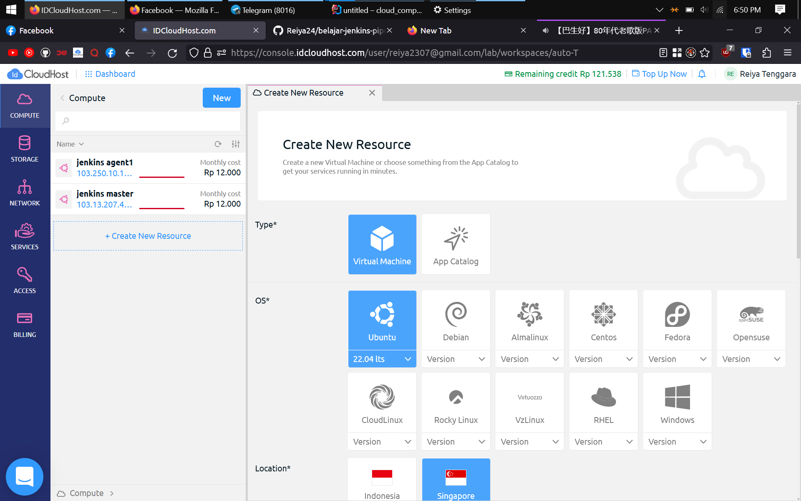

generate SSH key
```shell
ssh-keygen
```
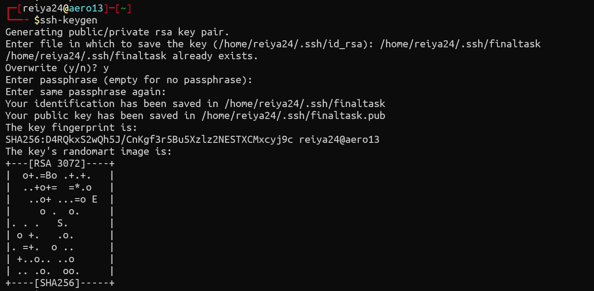

output pertama akan meminta lokasi dimana file ssh akan disimpan,
input lokasi yang diinginkan. atau enter untuk membiarkan default

output kedua akan meminta passphrase, saya memilih untuk mengkosongkannya
dengan menekan tombol enter

otomatis akan ada 2 file baru di direktori tersebut, 1 sebagai kunci ssh, 
1 lagi sebagai gembok ssh (berekstensikan .pub)

Setelah file SSH digenerate, kita gunakan ssh-copy-id untuk menaruh file
public key kita ke dalam virtual machine

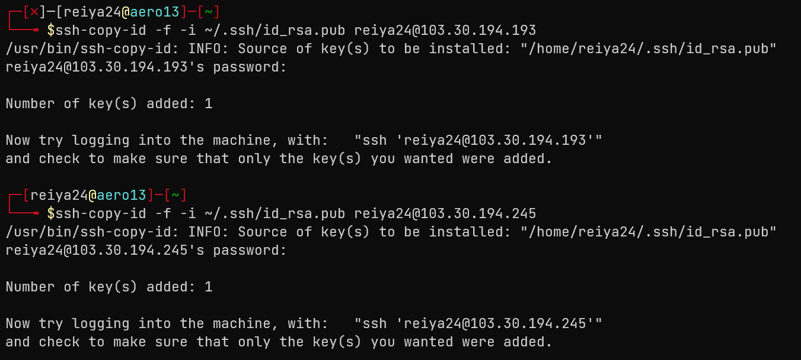

# menjalankan aplikasi wayshub-frontend menggunakan nodeJS

akses server menggunakan SSH

```shell
ssh -i lokasi_file_kunci_ssh username@ip_publik
```
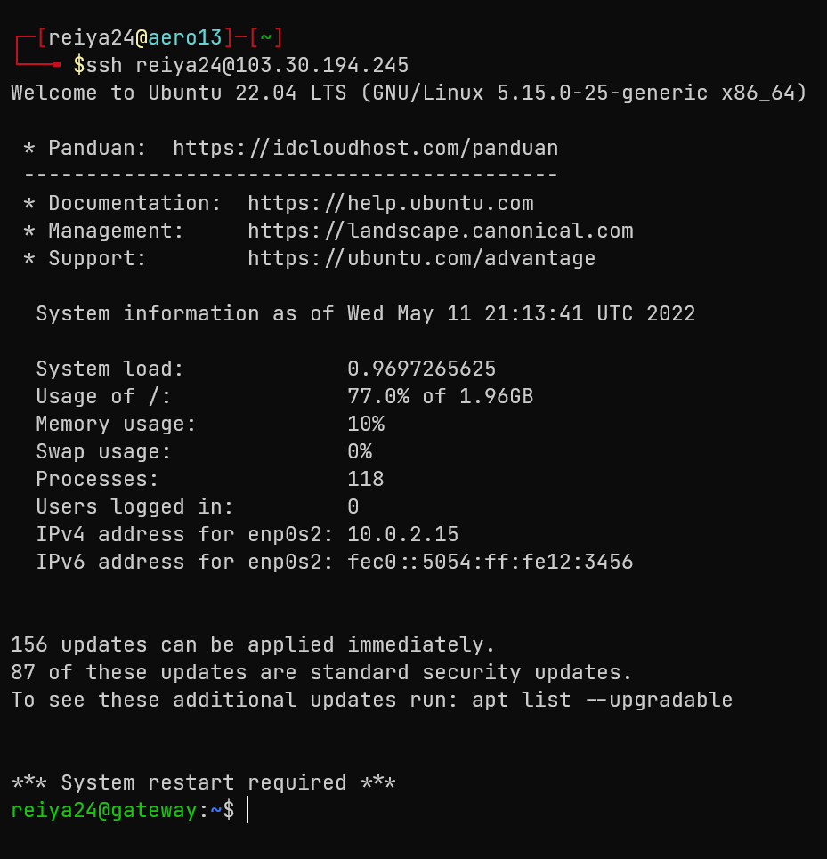

jalankan system update dan upgrade (opsional)

```shell
sudo apt update && sudo apt upgrade -y
```

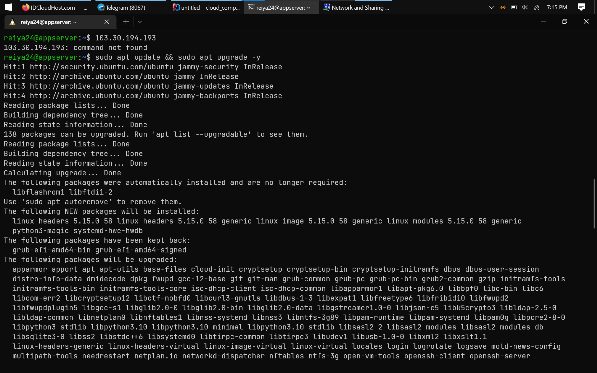

clone wayshub frontend
```shell
git clone https://github.com/dumbwaysdev/wayshub-frontend
```


copy script node installer dari komputer lokal ke server
```shell
scp -i kunci_ssh nama_file username@ip_public:lokasi_hasil_salinan
```
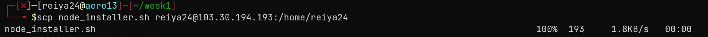

isi file node installer
```shell
#!/bin/bash
curl -o- https://raw.githubusercontent.com/nvm-sh/nvm/v0.38.0/install.sh | bash
eval "$(cat ~/.bashrc | tail -n +10)"
nvm install 16
nvm use 16
node -v
npm install pm2 -g
exec bash
```
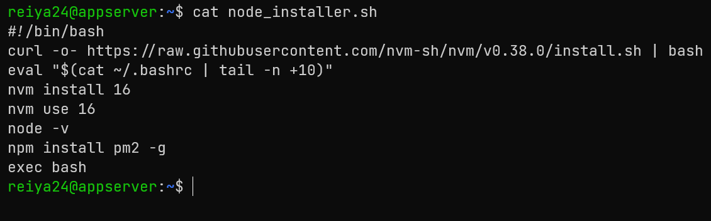

jalankan scriptnya
```shell
./node_installer.sh
```
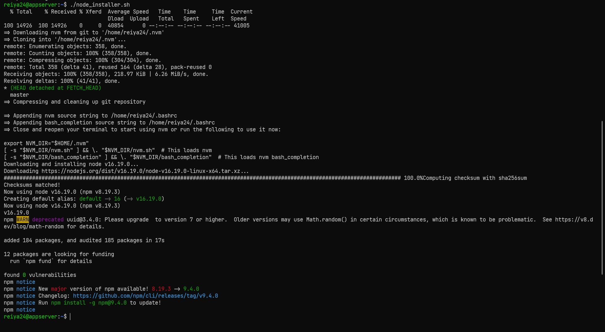

pada direktori wayshub frontend lakukan npm install untuk menginstall
semua depedensi yang diperlukank
```shell
npm install
```
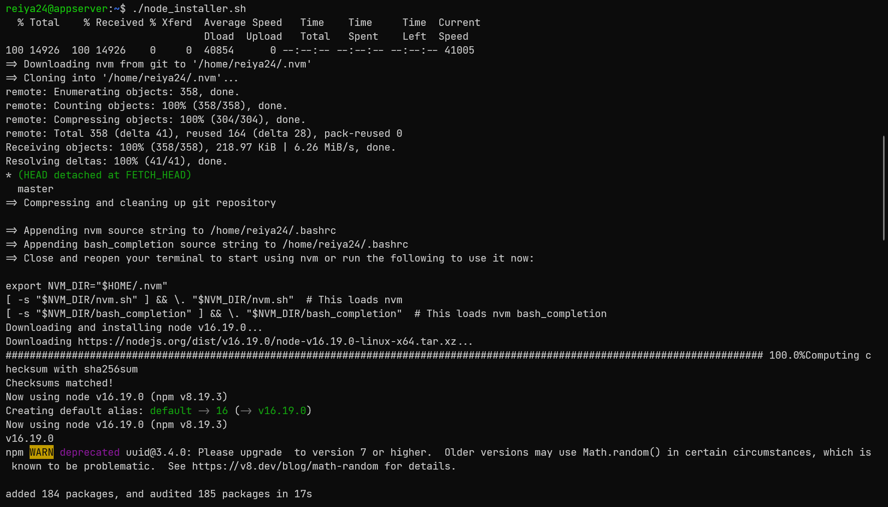

generate script pm2 agar mudah dijalankan
```shell
pm2 ecosystem simple
```
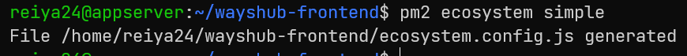

buka file ecosystem.config.js lalu ubah konfigurasinya.
nama bebas untuk script ketikan npm run start
```shell
module.exports = {
  apps : [{
    name   : "wayshub frontend",
    script : "npm run start"
  }]
}
```
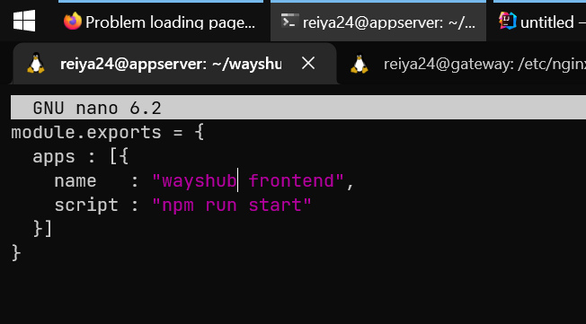

jalankan file konfigurasi pm2
```shell
pm2 start
```


buka web browser dan ketikan IP publik:3000


# setup domain di cloudflare

pergi ke situs cloudflare > pilih akun > website > klik
domain yang tersedia


pilih dns > add record > masukan domain dan ip public dari gateway
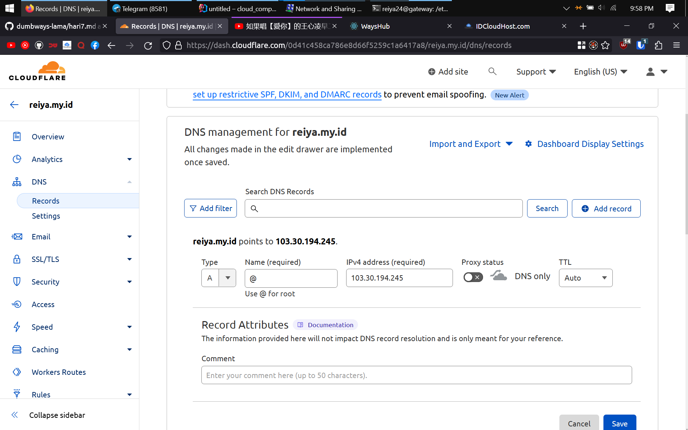

# reverse proxy nginx
akses server menggunakan ssh
update & upgrade system (opsional
```shell
sudo apt update && sudo apt upgrade -y
```
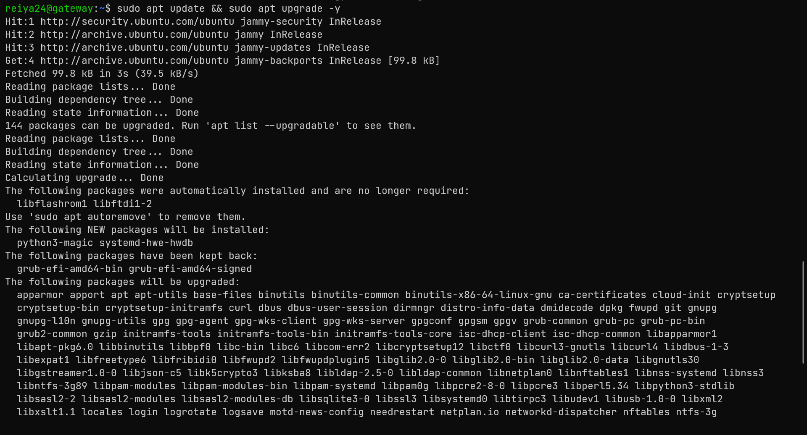

install nginx
```shell
sudo apt install nginx -y
```
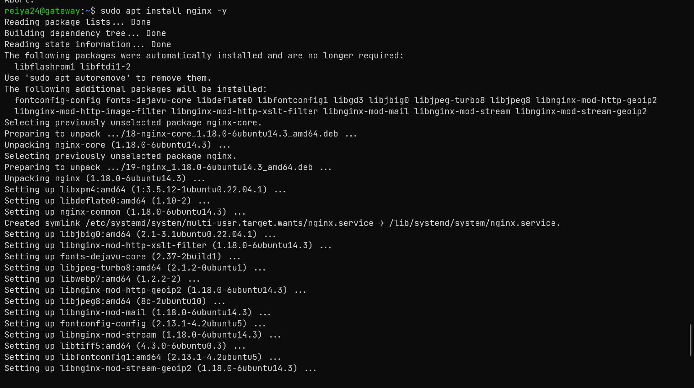

buat file konfigurasi ngix di /etc/nginx/sites-enabled dengan akses root
```shell
sudo nano /etc/nginx/sites-enabled
```

isikan kurang lebih berikut
```shell
server {
    server_name reiya.my.id;

    location / {
             proxy_pass http://10.116.106.209:3000;
    }
}
```
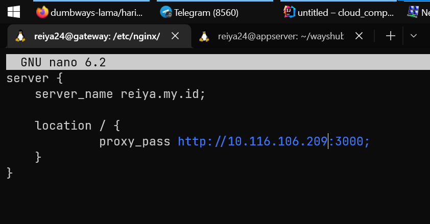
sesuaikan server_name dengan domain yang ada, dan
proxy pass masukan ip private dari appserver

gunakan perintah dibawah untuk mengecek apakah ada kesalahan syntax
di file konfigurasi ngix
```shell
sudo nginx -t
```
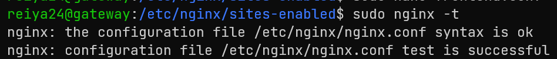

restart nginx untuk memperbarui perubahan konfigurasi
```shell
sudo systemctl restart nginx
```
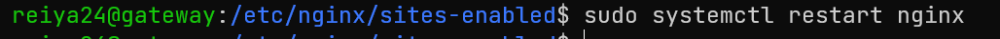

akses domain
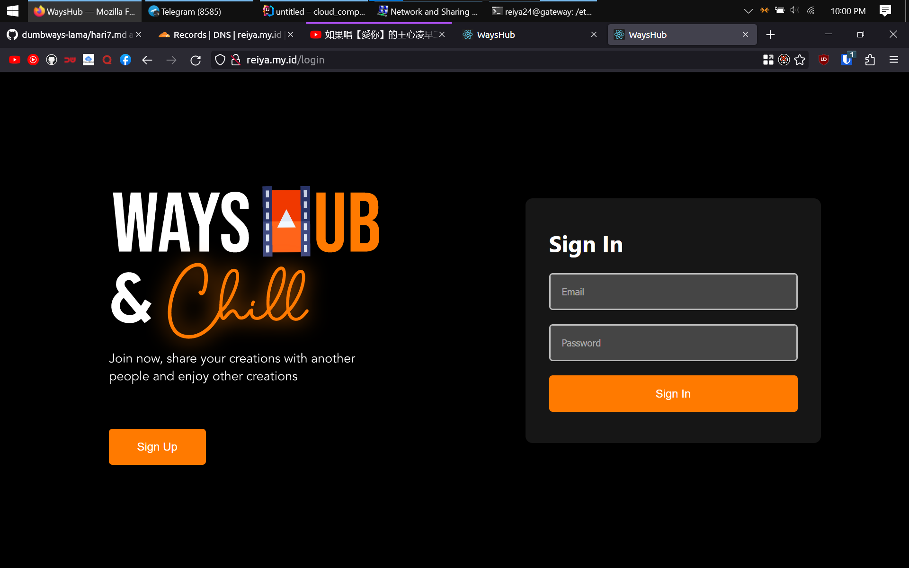

# menyalakan firewall

## webserver
nyalakan firewall menggunakan perintah
```shell
sudo ufw enbale
```


tambahkan rule untuk memberi akses ke port 22 untuk ssh, dan 80 untuk nginx
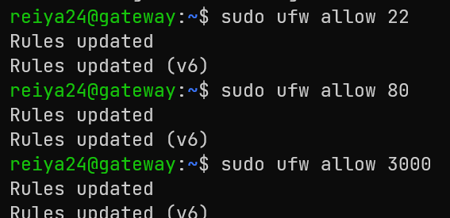

## appserver
gunakan perintah yang sama, namun port yang dibuka adalah 22 dan 3000
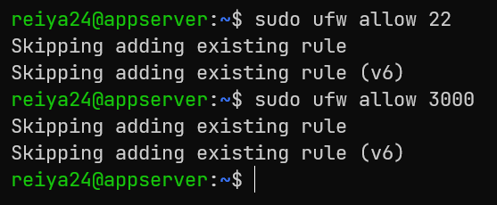

