# setup cloudflare untuk backend
pergi ke situs cloudflare > pilih akun > website > klik
domain yang tersedia
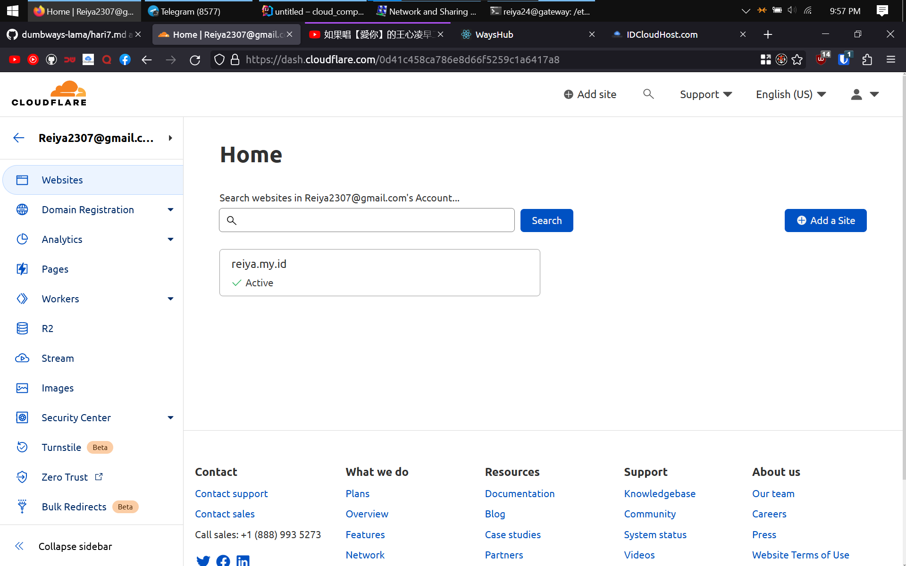

pilih dns > add record > masukan domain dan ip public dari gateway
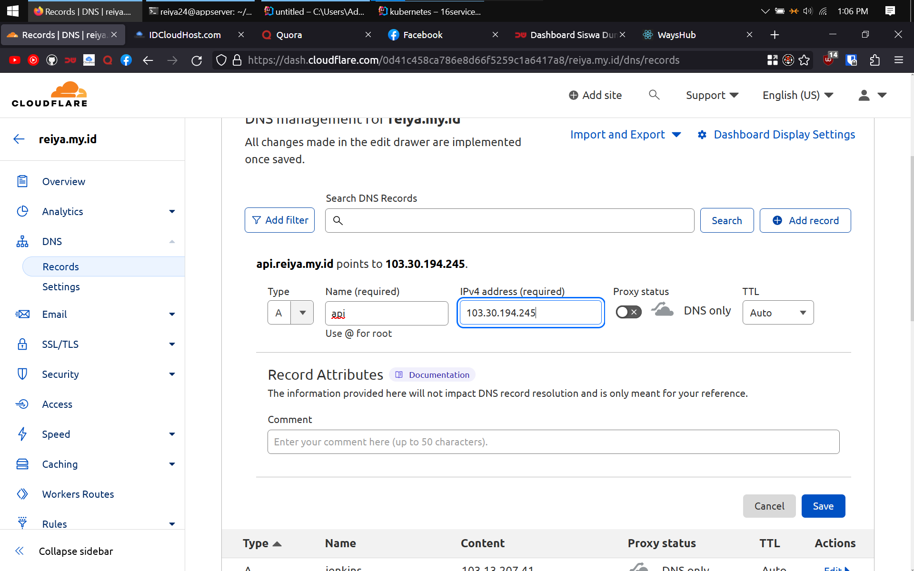

# webserver (setup domain untuk backend)

pada server gateway, buat file konfigurasi baru di direktori 
/etc/nginx/sites-enabled

isi file konfigurasi kurang lebih berikut
```shell
server {
    server_name api.reiya.my.id;

    location / {
             proxy_pass http://10.116.106.209:5000;
    }
}
```
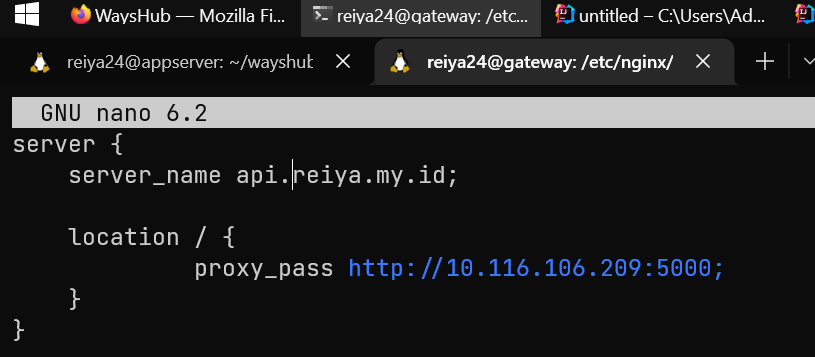
sesuaikan domain dan ip private dari appserver

cek syntax nginx
```shell
sudo nginx -t
```
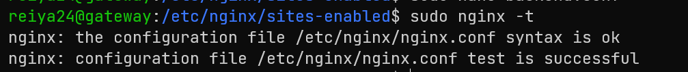

restart / reload nginx untuk memperbarui perubahan
```shell
sudo systemctl restart nginx
```
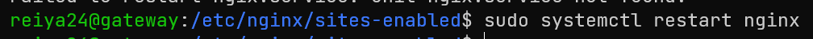

# setup domain frontend untuk menghubungkan ke backend
pada appserver, di folder wayshub_frontend/config/api.js, ubah baseURL
ke domain backend kita yang sudah dibuat
```shell
import axios from 'axios';

const API = axios.create({
    baseURL: "http://api.reiya.my.id/api/v1"
});

const setAuthToken = (token) => {
    if(token){
        API.defaults.headers.common['Authorization'] = `Bearer ${token}`;
    } else {
        delete API.defaults.headers.common['Authorization'];
    }
}

export {
    API,
    setAuthToken
}
```
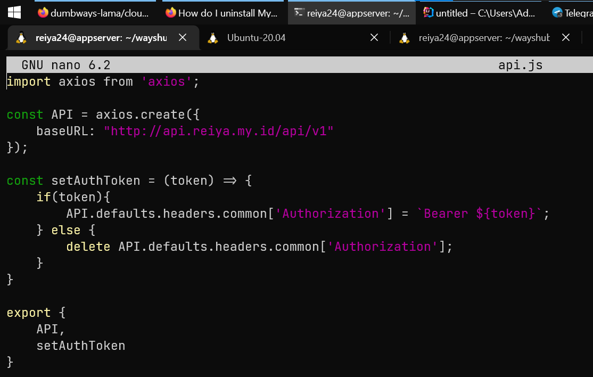

# setup mysql database
pada appserver, install mysql dengan menggunakan perintah
```shell
sudo apt install mysql-server -y
```
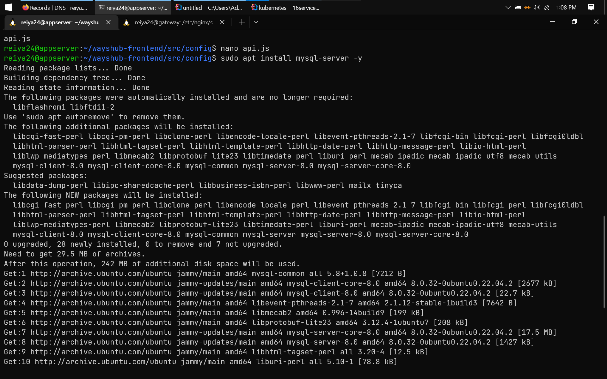

kita tidak dapat langsung menjalankan mysql_secure_instalation karena 
dapat menyebabkan recrusive looping saat form pengisian password root, 
untuk mencegahnya, kita perlu seting password secara manual.

jalankan mysql dengan sudo
```shell
sudo mysql
```
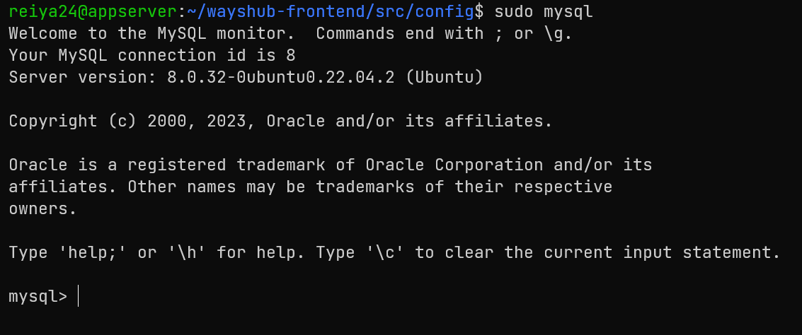

ubah password root dengan menggunakan perintah dibawah, sesuaikan password 
dengan kebutuhan
```shell
ALTER USER 'root'@'localhost' IDENTIFIED WITH mysql_native_password BY 'kata_sandi';
```
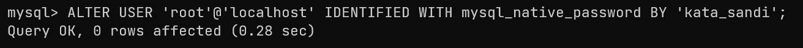

untuk menyimpan perubahan, gunakan perintah
```shell
FLUSH PRIVILEGES;
```
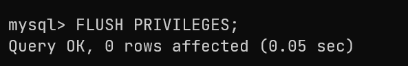

exit mysql mengunakan perintah exit; lalu kita baru bisa menjalankan mysql_secure_instalation 
tanpa memiliki maslah
```shell
sudo mysql_secure_installation
```

masukan password root yang sebelumnya sudah disetel image

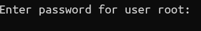

setelah itu, pilih y untuk mengatur setingan password validation 

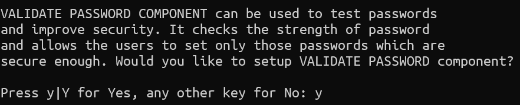

pilih 0 untuk mengatur password validationnya menjadi low 
(agar password bisa diisi tanpa kombinasi nomor, karakter spesial, dan mixed case)

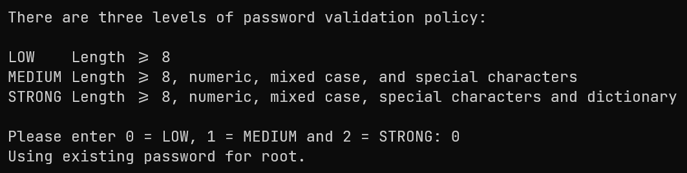

input y untuk mengubah root password, atau sembarang kata untuk tidak
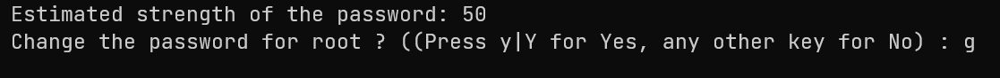

pilih y untuk menghapus anonymous user (anonymous user memungkinkan 
kita untuk masuk ke mysql tanpa mempunyai akun)

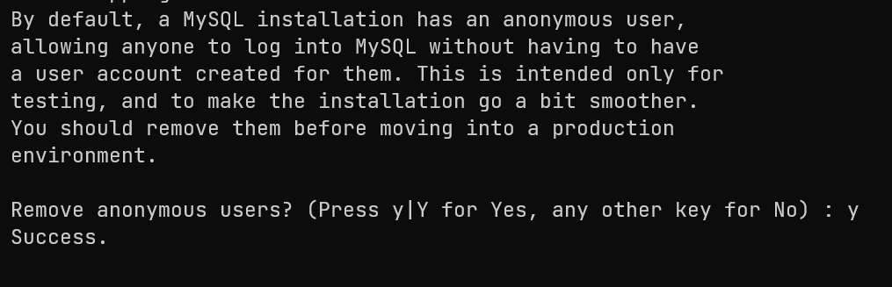

pilih y untuk mematikan login secara remote 

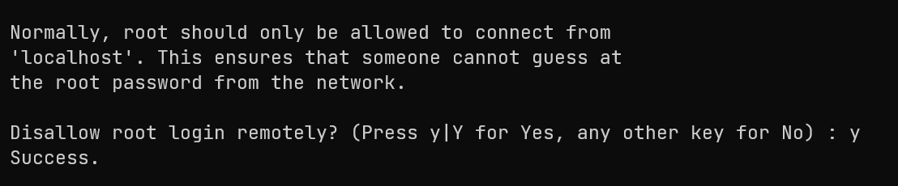

pilih y untuk menghapus database tes 

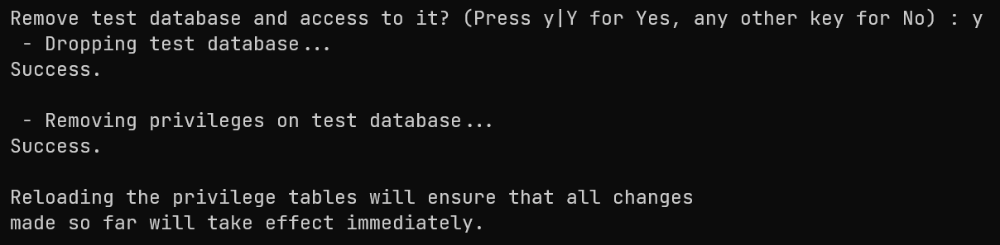

pilih y untuk mereload setingan mysql

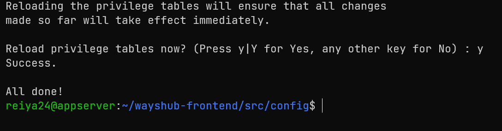

setelah selesai, kita masuk ke mysql prompt menggunakan 
user root, jalankan
```shell
sudo mysql -u root -p
```
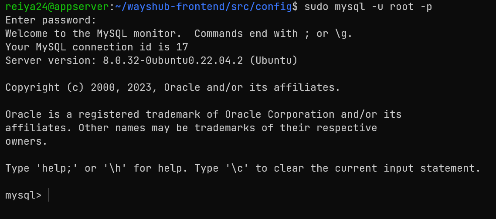

buat user baru menggunakan perintah
```shell
CREATE USER 'nama_user_baru'@'%' IDENTIFIED BY 'isi_password';
```
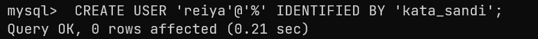

beri perizinan penuh kepada user baru kita
```shell
GRANT ALL PRIVILEGES ON * . * TO 'reiya''@''%';
```

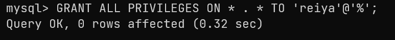

flush privileges untuk menyimpan semua perubahan

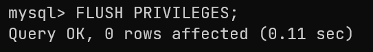

# setup wayshub backend
clone wayshub backend
```shell
git clone https://github.com/dumbwaysdev/wayshub-backend
```
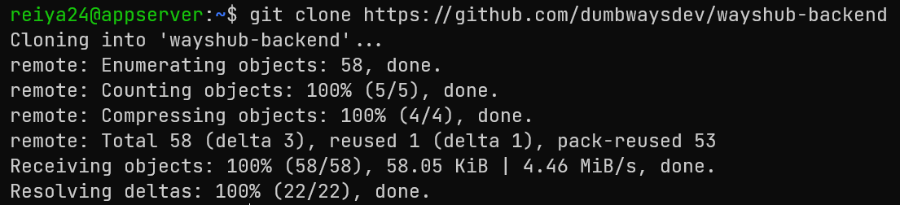

setup konfigurasi backend dengan database di direktori config/config.json

```shell
{
  "development": {
    "username": "reiya",
    "password": "kata_sandi",
    "database": "dbwayshub",
    "host": "127.0.0.1",
    "dialect": "mysql"
  },
  "test": {
    "username": "root",
    "password": null,
    "database": "database_test",
    "host": "127.0.0.1",
    "dialect": "mysql"
  },
  "production": {
    "username": "root",
    "password": null,
    "database": "database_test",
    "host": "127.0.0.1",
    "dialect": "mysql"
  }
}
```
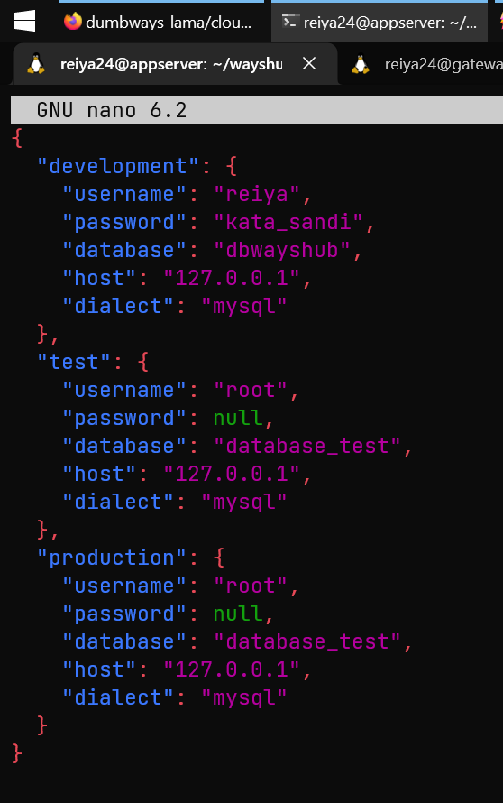

install sequelize-cli
```shell
npm install -g sequelize-cli
```
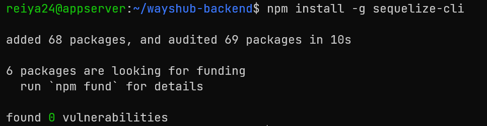

buat database dbwayshub menggunakan 
```shell
sequelize db:create
```
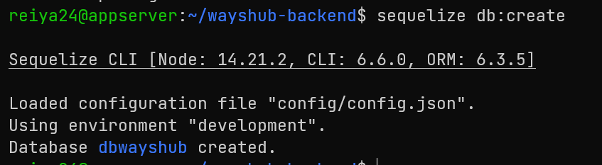

generate isi dari database
```shell
sequelize db:migrate
```
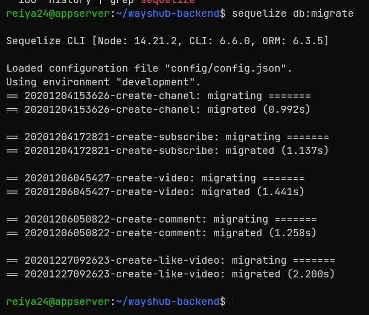

generate script pm2
```shell
pm2 ecosystem simple
```
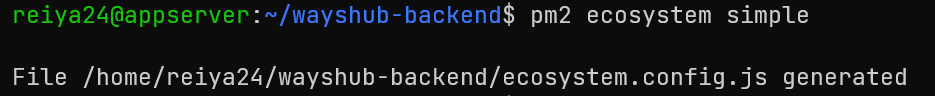

buka file ecosystemnya, nama disesuaikan keinginan

```shell
module.exports = {
  apps : [{
    name   : "wayshub_backend",
    script : "npm run start"
  }]
}
```


jalankan pm2
```shell
pm2 start
```


integrasi frontend dengan backend berhasil

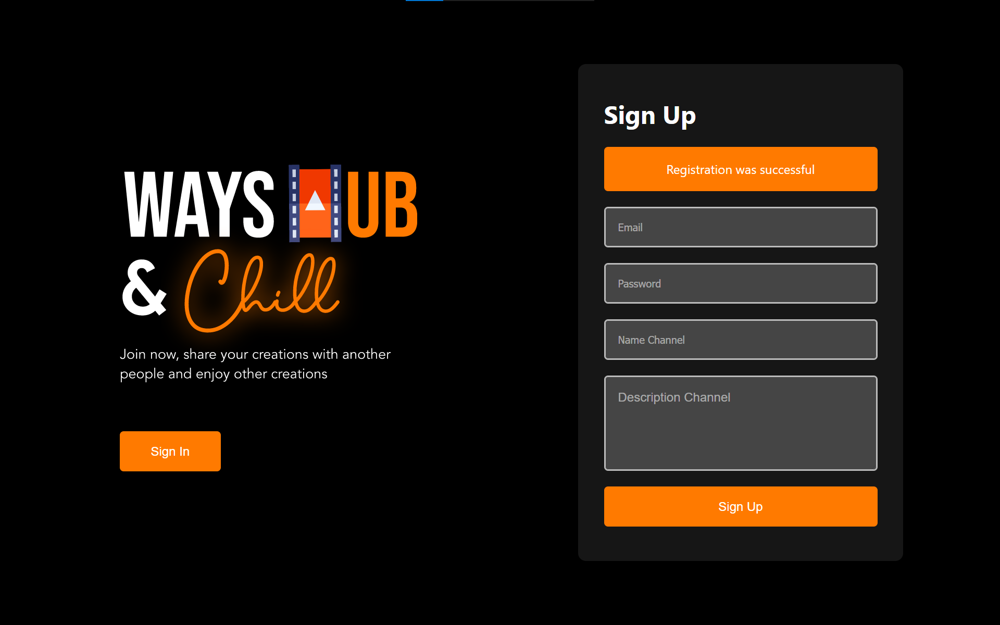

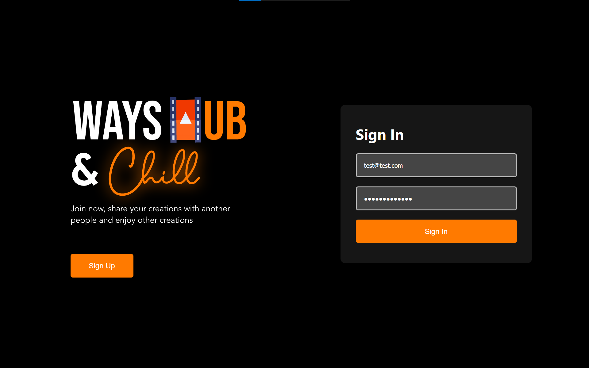

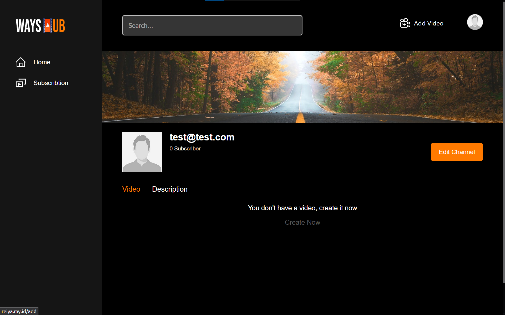

# pemasangan https

pada server gateway update snap untuk mendapatkan package terbaru
```shell
sudo snap install core; sudo snap refresh core
```
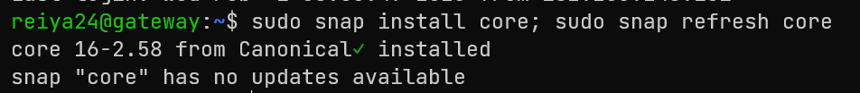

install certbot
```shell
sudo snap install --classic certbot
```
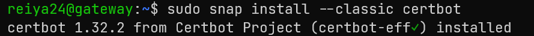

tambahkan path certbot agar perintah certbot dapat dijalankan
```shell
sudo ln -s /snap/bin/certbot /usr/bin/certbot
```
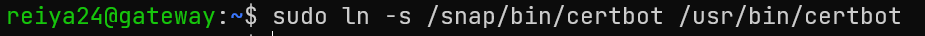

seting agar certbot dapat menggunakan plugin
```shell
sudo snap set certbot trust-plugin-with-root=ok
```
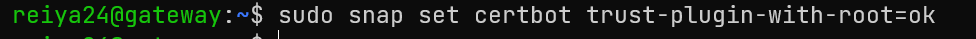

install certbot dns plugin
```shell
sudo snap install certbot-dns-nama_dns_provider
```
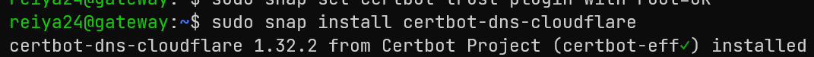

buat file untuk menyimpan API token
```shell
nano /home/reiya24/.my_config/cloudflare.ini
```
isi file
```shell
dns_cloudflare_email = "nama_email@nama_email.com"
dns_cloudflare_api_key = "nomor_api_token"
```
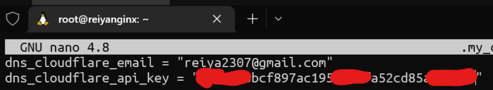

untuk mengambil global token, pergi ke dashboard cloudflare > my
profile > API tokens> view global API keys 
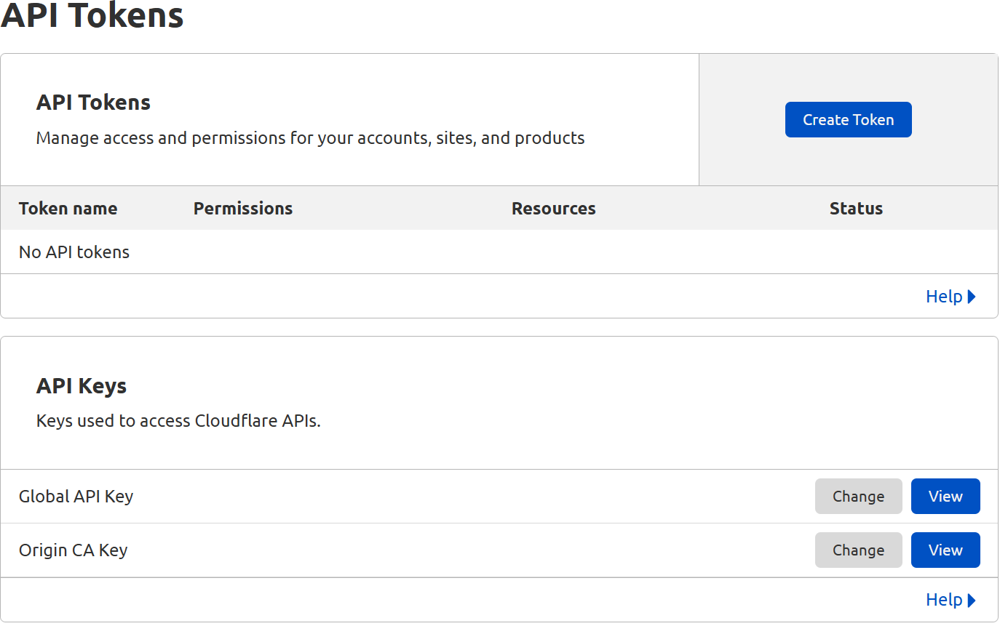

jalankan certbot
```shell
certbot -i nginx \
  --dns-cloudflare \
  --dns-cloudflare-credentials lokasi_API-key \
  -d domain_yang_ingin_didaftarkan \
  -d *.domain_yang_ingin_didaftarkan
```
pilih y

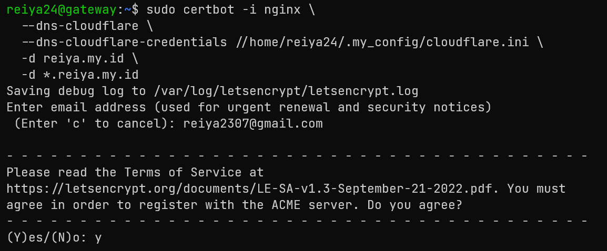

pemasangan SSL berhasil

# firewall
pada kedua server kita, nyalakan firewall
```shell
sudo ufw enable
```


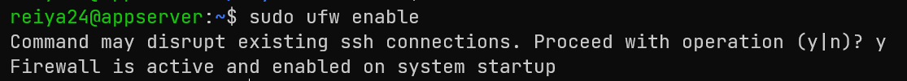

buka port-port yang dibutuhkan
```shell
sudo ufw allow nomor_port
```
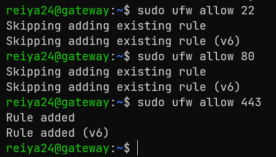
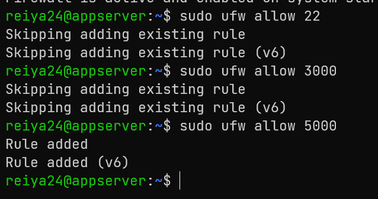