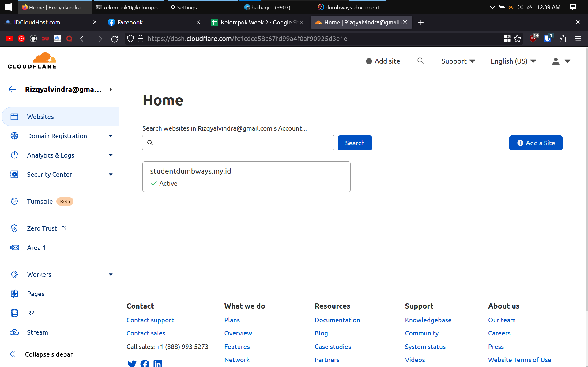
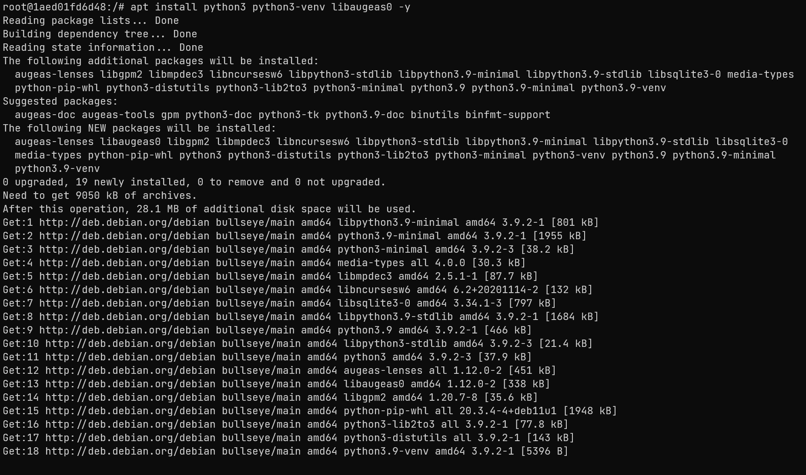
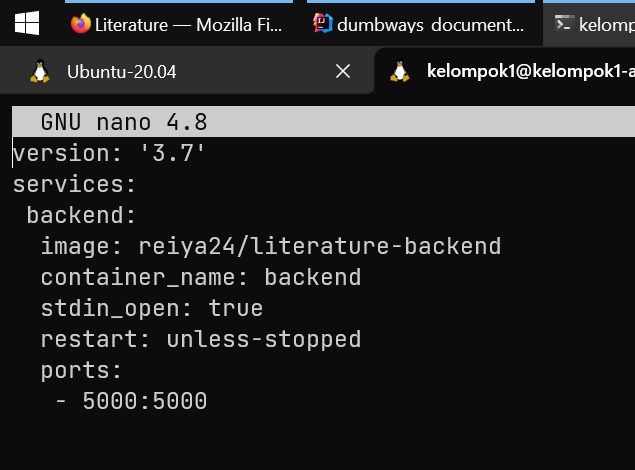

# setup domain di cloudflare
pergi ke situs cloudflare > pilih akun > website > klik
domain yang tersedia


pilih dns > add record > masukan domain dan ip public
dari gateway


# setup nginx on top docker

install docker di gateway menggunakan script
```shell
#!/bin/bash

read -p "ketik y untuk menginstall docker, ketik sembarang kata untuk membatalkan   " choice

if [ $choice = "y" ]
then
    echo "###########################"
    echo "update repository"
    echo "###########################"
    sudo apt-get update -y

    echo "menghapus semua versi lama docker bila ada"
    sudo apt-get remove docker docker-engine docker.io containerd runc -y
    
    echo "###########################"
    echo "install depedency yang diperlukan"
    echo "###########################"
    sudo apt-get install \
        ca-certificates \
        curl \
        gnupg \
        lsb-release -y
    
    echo "###########################"
    echo "install GPG key"
    echo "###########################"
    sudo mkdir -p /etc/apt/keyrings
    curl -fsSL https://download.docker.com/linux/ubuntu/gpg | sudo gpg --dearmor -o /etc/apt/keyrings/docker.gpg

    echo "###########################"
    echo "set up repository"
    echo "###########################"
    echo \
        "deb [arch=$(dpkg --print-architecture) signed-by=/etc/apt/keyrings/docker.gpg] https://download.docker.com/linux/ubuntu \
        $(lsb_release -cs) stable" | sudo tee /etc/apt/sources.list.d/docker.list > /dev/null

    echo "###########################"
    echo "update repository lagi"
    echo "###########################"
    sudo apt-get update -y
    
    echo "###########################"
    echo "install docker engine, containerd, dan docker compose"
    echo "###########################"
    sudo apt-get install docker-ce docker-ce-cli containerd.io docker-compose-plugin -y

    echo "###########################"
    echo "tambahkan user yang ada sekarang ke dalam grup docker"
    echo "###########################"
    sudo usermod -aG docker $(whoami)
    pwd
    
    echo "###########################"
    echo "docker berhasil di install"
    echo "###########################"
    exec bash
else
    echo "script berhenti"
fi
```


buat file yang berisi default konfigurasi nginx.conf karena akan 
di bind mount
```shell

user  nginx;
worker_processes  auto;

error_log  /var/log/nginx/error.log notice;
pid        /var/run/nginx.pid;


events {
    worker_connections  1024;
}


http {
    include       /etc/nginx/mime.types;
    default_type  application/octet-stream;

    log_format  main  '$remote_addr - $remote_user [$time_local] "$request" '
                      '$status $body_bytes_sent "$http_referer" '
                      '"$http_user_agent" "$http_x_forwarded_for"';

    access_log  /var/log/nginx/access.log  main;

    sendfile        on;
    #tcp_nopush     on;

    keepalive_timeout  65;

    #gzip  on;

    include /etc/nginx/conf.d/*.conf;
}
```


buat file docker compose
```shell
version: '3.7'

services:
  nginx:
    container_name: nginx
    image: nginx:latest
    restart: unless-stopped
    stdin_open: true
    ports:
      - 80:80
      - 443:443
    volumes:
      - /home/kelompok1/konfigurasi_nginx/sites-enabled:/etc/nginx/sites-enabled
      - /home/kelompok1/konfigurasi_nginx/nginx.conf:/etc/nginx/nginx.conf
      - /home/kelompok1/konfigurasi_nginx/letsencrypt:/etc/letsencrypt
```


jalankan docker compose 
```shell
docker compose up -d
```


# setup reverse proxy

buat file untuk konfigurasi reverse proxy untuk frontend dan backend
di folder yang sudah di bind mount menggunakan sudo,
gunakan ip private untuk proxy pass

```shell
server {
    server_name literature.studentdumbways.my.id;

    location / {
         proxy_pass http://10.36.116.163:3000;
    }
}

server {
    server_name api.literature.studentdumbways.my.id;

    location / {
         proxy_pass http://10.36.116.163:5000;
    }
}
```


buka file nginx.conf yang sudah di mount menggunakan sudo, tambahkan folder konfigurasi
agar dapat dibaca (nginx di docker tidak menginclude sites-enabled)
```shell
include /etc/nginx/sites-enabled/*.conf;
```


masuk ke container
```shell
docker container exec -i -t nama_container /bin/bash
```


cek syntax nginx
```shell
nginx -t
```


reload nginx
```shell
service nginx reload
```


# pemasangan https menggunakan certbot

masuk ke container
```shell
docker container exec -i -t nama_container /bin/bash
```


update package
```shell
apt update
```


install depdensi yang diperlukan
```shell
apt install python3 python3-venv libaugeas0 -y
```


buat virtualenv
```shell
python3 -m venv /opt/certbot/
```

```shell
/opt/certbot/bin/pip install --upgrade pip
```


install cerbot untuk nginx
```shell
/opt/certbot/bin/pip install certbot certbot-nginx
```


tambahkan path untuk memastikan cerbot dapat berjalan
```shell
ln -s /opt/certbot/bin/certbot /usr/bin/certbot
```


jalankan certbot untuk nginx
```shell
certbot --nginx
```

masukan email


input yes


input N


tekan enter untuk memasukan semua domain


# setup database
buat docker compse untuk mysql
```shell
version: '3.7'

services:
  database:
    container_name: database
    image: mysql:latest
    environment:
      MYSQL_DATABASE: 'literature'
      MYSQL_USER: 'kelompok1'
      MYSQL_PASSWORD: 'kelompok1'
      MYSQL_ROOT_PASSWORD: 'kelompok1'
    ports:
      - '3306:3306'
    restart: unless-stopped
    volumes:
      - ~/konfigurasi_mysql:/var/lib/mysql
```


jalankan docker compose
```shell
docker compose up -d
```


# setup frontend

clone literature frontend
```shell
git clone https://github.com/dumbwaysdev/literature-frontend
```


buat file .dockerignore, masukan file & folder mana saja yang tidak
ingin dimasukan ketika di build
```shell
nano .dockerignore
```


ubah file src/config/config.js, ubah domain


buat Dockerfile
```shell
FROM node:14-alpine as build
WORKDIR /home/app
COPY . .
RUN npm install

FROM node:14-alpine
WORKDIR /home/app
COPY --from=build /home/app /home/app
EXPOSE 3000
CMD ["npm","start"]
```


build dockerfile
```shell
docker build -t reiya24/literature-frontend -t naninanides/literature-frontend .
```


buat docker compose
```shell
version: '3.7'
services:
 frontend:
   container_name: frontend
   image: naninanides/literature-frontend
   stdin_open: true
   restart: unless-stopped
   ports:
    - 3000:3000
```
jalankan docker compose 
```shell
docker compose up -d
```


# setup backend

clone literature backend
```shell
git clone https://github.com/dumbwaysdev/literature-backend
```


ubah konfigurasi file config/config.json


buat Dockerfile

```shell
FROM node:14-alpine AS build
WORKDIR /home/app
COPY .. .
RUN npm install
RUN npm install -g sequelize-cli
RUN npx sequelize db:migrate

FROM node:14-alpine
COPY --from=build /home/app /home/app
WORKDIR /home/app
CMD ["node","server.js"]
```


build Dockerfile
```shell
docker build -t reiya24/literature-backend -t naninanides/literature-backend .
```


buat docker compose

```shell
version: '3.7'
services:
 backend:
  image: reiya24/literature-backend
  container_name: backend
  stdin_open: true
  restart: unless-stopped
  ports:
   - 5000:5000
```


jalankan docker compose


# membuat private registry
buat docker compose
```shell
version: '3.3'
services:
  registry:
    container_name: private_registry
    image: registry:latest
    restart: always
    ports:
    - "5005:5000"
    environment:
      REGISTRY_STORAGE_FILESYSTEM_ROOTDIRECTORY: /data
    volumes:
      - /home/kelompok1/private_registry/data:/datae
```
jalankan docker compose
```shell
docker compose up -d
```


tambahkan file /etc/docker/daemon.json, masukan ip kita
```shell
{
   "insecure-registries" : ["10.36.116.163:5005"]
}
```


ubah tag image


push imagenya

# hasil website


