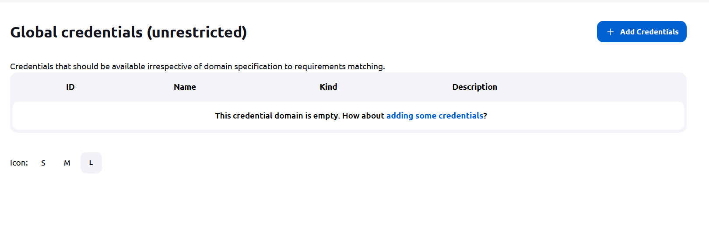
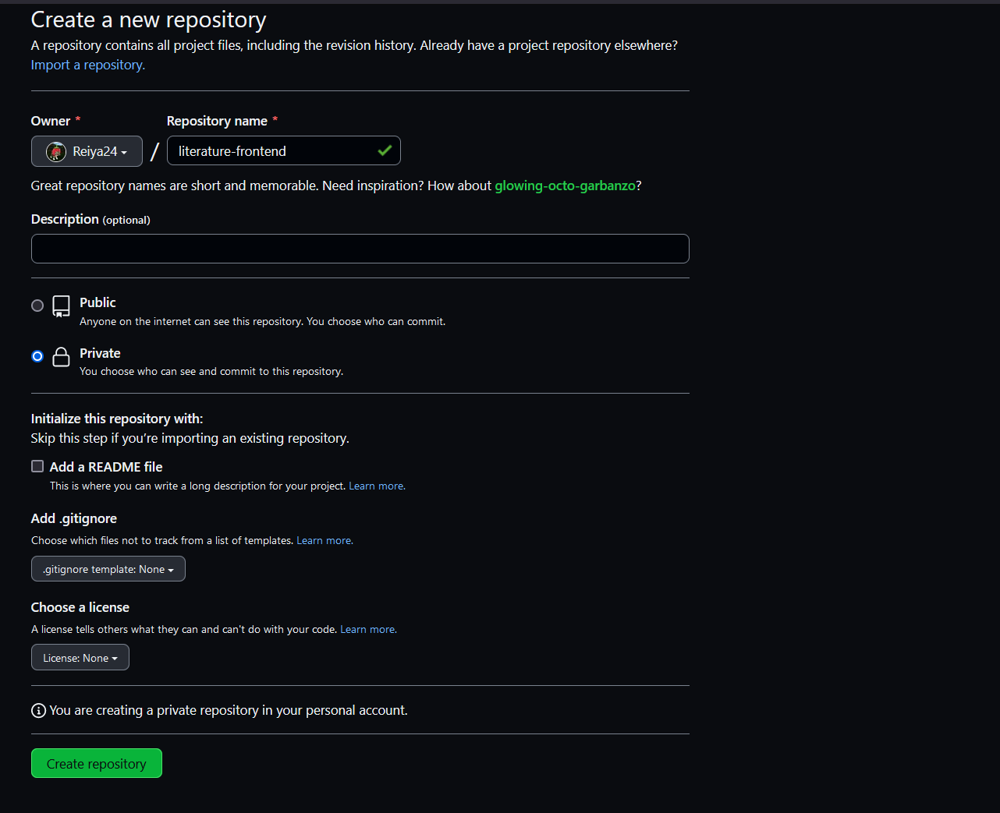
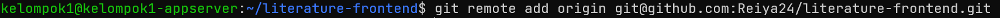

# install jenkins on top docker

buat file docker compose
```shell
version: '3.7'
services:
  jenkins:
    container_name: jenkins
    image: jenkins/jenkins:latest-jdk11
    privileged: true
    user: root
    restart: unless-stopped
    ports:
      - 8080:8080
    volumes:
      - ~/jenkins_config:/var/jenkins_home
      - ~/jenkins-docker-certs:/certs/clien
```

jalankan docker compose
```shell
docker compose up -d
```


# buat reverse proxy untuk jenkins

tambahkan domain di cloudflare


buat file konfigurasi reverse proxy di webserver
```shell
server {
    server_name jenkins.literature.studentdumbways.my.id;

    location / {
             proxy_pass http://10.36.116.151:8080;
    }
}
```


masuk ke container nginx
```shell
docker container exec -it nginx bash
```


test syntax nginx
```shell
nginx -t
```


reload nginx
```shell
service nginx reload
```


jalankan certbot untuk mendapatkan SSL
```shell
certbot --nginx
```


# setup jenkins
cek logs container jenkins untuk mendapatkan password
```shell
docker container logs jenkins
```


copy kode tersebut, dan paste di web browser jenkins


pilih select plugin to install


cari ssh agent dan ceklis


tunggu proses instalasi


masukan form yang diperlukan


setup domain jenkins


pilih start using jenkins


# setup SSH credentials

generate ssh


copy privete keynya untuk dipaste ke dalam jenkins


pada website jenkins pilih manage jenkins


configure global security


pilih global


pilih add credentials


masukan form


# tambahkan public key di github
copy publik key


paste di github, masuk ke website github, settings


SSH and GPG keys


new SSH keys


paste isi dari public key


# tambahkan public key di appserver
copy publik key


paste di authorized_keys di appserver


# seting agar bisa terkoneksi dengan github di koneksi pertama
pilih manage jenkins > configure global security


scroll ke bagian paling bawah, accept first connection


# setup notifikasi dengan slack
install plugin slack notification, dashboard > manage jenkins, manage plugins


pada available plugins, cari plugin slack notification, pilih
download now and isntall after restart


tunggu proses instalasi


buka halaman https://my.slack.com/services/new/jenkins-ci, lalu pilih workspace


pilih channel yang akan digunakan


setelah itu scroll kebawah, kita akan menemukan team subdomain, dan integration token credential ID


copy integration token credential ID, lalu tambahkan di credential jenkins, pada menu kind, pilih secret text


setelah itu, pada dashboard jenkins > manage jenkins > 
configure system, cari menu slack, masukan form yang diperlukan,
untuk workspace masukan team subdomain tadi, disarankan untuk 
test connection terlebih dahulu sebelum save


integrasi berhasil


# membuat private repository frontend

buat repository baru di github


masukan form


pada folder frontend di appserver, inisialisasi git
```shell
git init
```


tambahkan email dan nama di git config
```shell
git config --global user.email "email"
git config --global user.name "password"
```


masukan semua file ke dalam staging area
```shell
git add .
```


lakukan commit
```shell
git commit -m "pertama"
```


buat branh main
```shell
branch -M
```


tambahkan git remote ke repository yang kita buat
```shell
git remote add origin git@github.com:Reiya24/literature-frontend.git
```


lakukan push
```shell
git push -u origin main
```


# setup github webhook
pada project github, pilih settings, webhook


pilih add webhooks


untuk payloadmasukan url jenkins dan tambahkan github-webhook, 
content type pilih
applicatoin/jsonklik send me
everything


setup berhasil


# membuat pipeline job

pilih create a job


masukan nama job,lalu pilih pipeline


pada build trigger, pilih GitHub hook trigger for GITScm polling


pada pipeline, pilih pipeline from SCM, masukan repository URL dan
credentials, pilih branch, lalu masukan path dari jenkinsfile,
matikan lightweight checkout


# pipeline
pada folder frontend, buat script pipeline bernama Jenkinsfile
```shell
pipeline {
    agent any

    environment{
        def branch = "main"
        def nama_repository = "origin"
        def directory = "~/literature-frontend"
        def credential = 'appserver'
        def server = 'kelompok1@10.36.116.163'
        def docker_image = 'reiya24/literature-frontend'
        def nama_container = 'frontend'
    }

    options {
        disableConcurrentBuilds()
        timeout(time: 30, unit: 'MINUTES')
    }

    stages {

        stage('kirim notifikasi ke slack') {
            steps {
                slackSend(message: "mulai job baru : ${env.JOB_NAME} ${env.BUILD_NUMBER} (<${env.BUILD_URL}|Open>)")
            }
        }

        stage('pull repository dari github ') {
            steps {
                sshagent([credential]){
                    sh"""
                    ssh -o StrictHostKeyChecking=no ${server} << EOF
                    cd ${directory}
                    git pull ${nama_repository} ${branch}
                    exit
                    EOF"""
                }
            }
        }

        stage('docker compose down') {
            steps {
                sshagent([credential]){
                    sh"""
                    ssh -o StrictHostKeyChecking=no ${server} << EOF
                    cd ${directory}
                    docker compose down
                    exit
                    EOF"""
                }
            }
        }

        stage('build image frontend') {
            steps {
                sshagent([credential]){
                    sh"""ssh -o StrictHostKeyChecking=no ${server} << EOF
                    cd ${directory}
                    docker build -t ${docker_image}:latest .
                    exit
                    EOF"""
                }
            }
        }

        stage('jalankan docker compose') {
            steps {
                sshagent([credential]){
                    sh"""ssh -o StrictHostKeyChecking=no ${server} << EOF
                    cd ${directory}
                    docker compose up -d
                    exit
                    EOF
                    """
                }
            }
        }
        
        stage('push image ke dockerhub') {
            steps {
                sshagent([credential]){
                    sh"""
                    ssh -o StrictHostKeyChecking=no ${server} << EOF
                    cd ${directory}
                    docker image push ${docker_image}:latest
                    exit
                    EOF"""
                }
            }
        }
    }

    post {

        aborted {
            slackSend(message: "build digagalkan secara manual : ${env.JOB_NAME} ${env.BUILD_NUMBER} (<${env.BUILD_URL}|Open>)")
        }
        failure {
            slackSend(message: "build failed lmao : ${env.JOB_NAME} ${env.BUILD_NUMBER} (<${env.BUILD_URL}|Open>)")
        }

        success {
            slackSend(message: "build success horeeeee : ${env.JOB_NAME} ${env.BUILD_NUMBER} (<${env.BUILD_URL}|Open>)")
        }
        
    }
}
```


lakukan git push
```shell
git add .
git commit -m "test Jenkinsfile"
git push origin main
```


setelah itu Jenkins akan mentrigger build secara otomatis


notifikasi berjalan dengan baik


# lakukan hal yang sama dengan backend