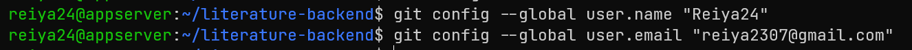
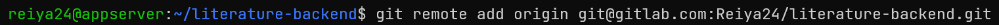
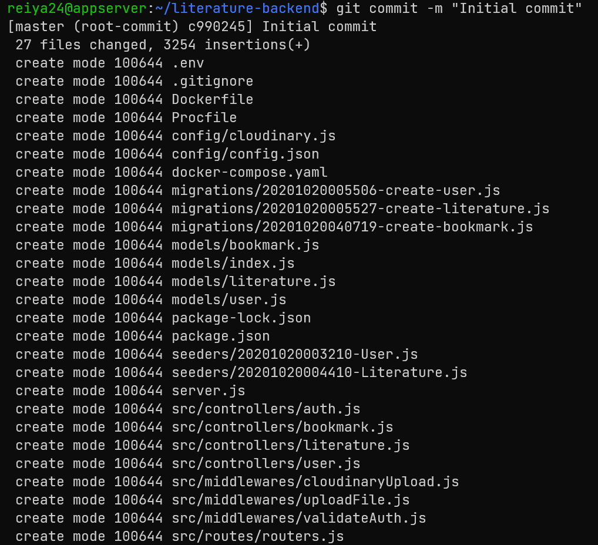
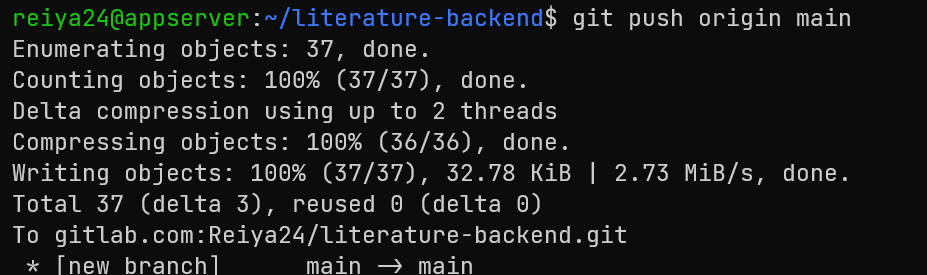
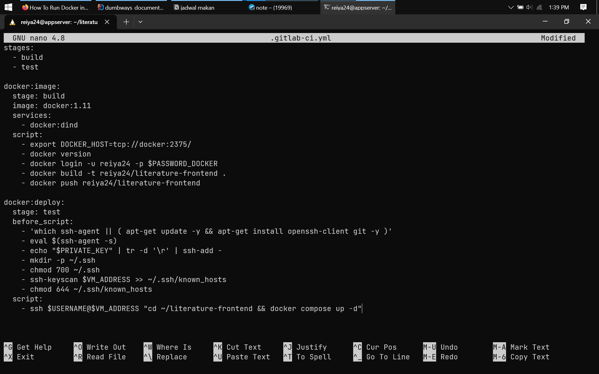
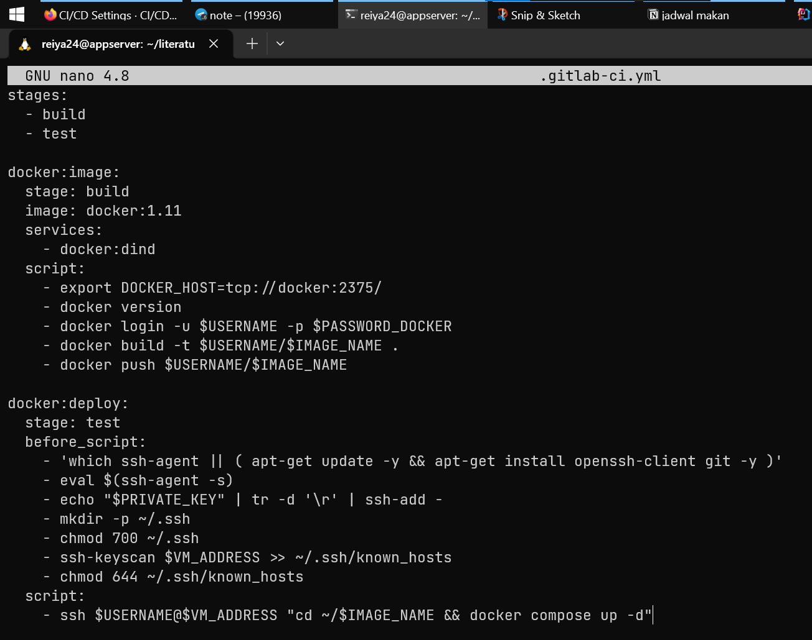
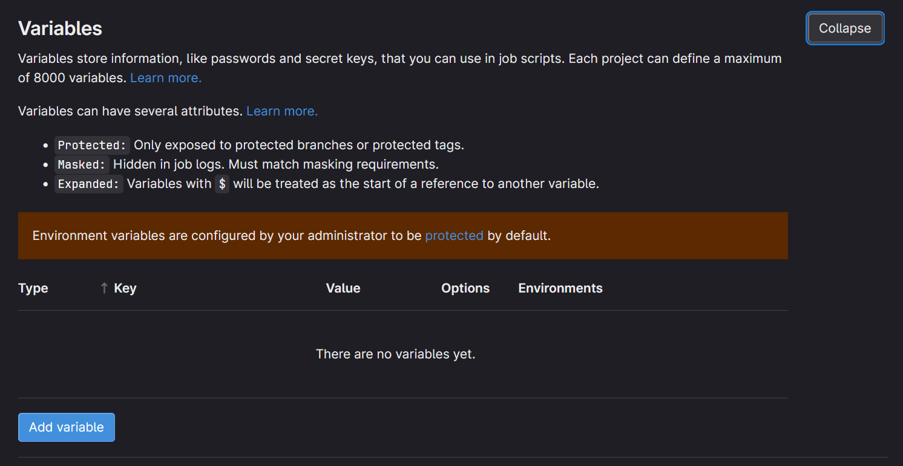
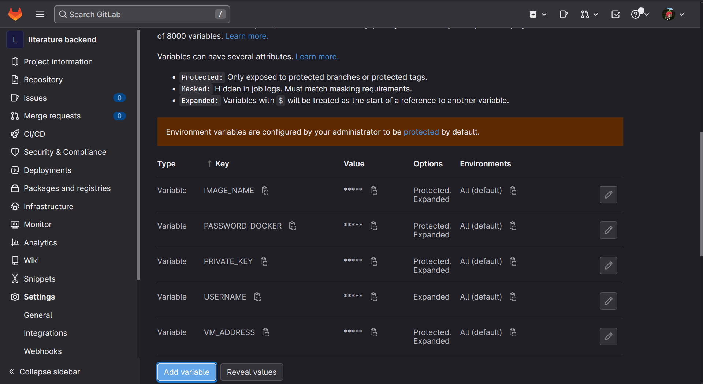
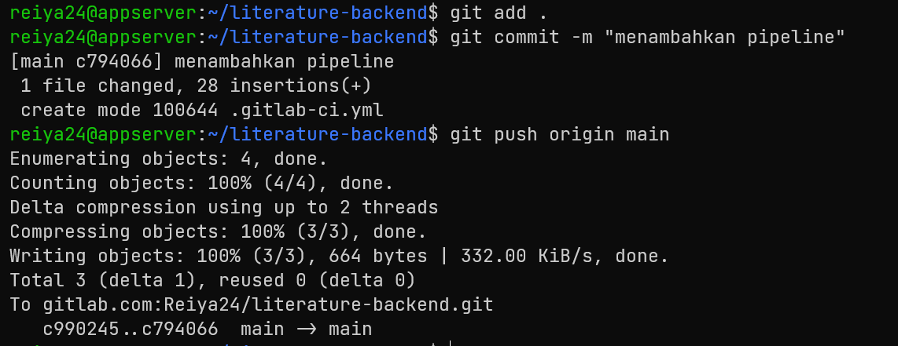

# tambahkan public ke ke akun gitlab
pada [halaman gitlab](https://gitlab.com/) 
klik foto profile > preferences > SSH keys, tambahkan public key

# membuat repository di gitlab

pada [halaman gitlab](https://gitlab.com/), pilih new project > 
create blank project > masukan deskripsi project


# setup git di appserver
atur name dan email di git config
```shell
git config --global user.name "nama"
```
```shell
git config --global user.email "password"
```


inisalisasi direktori agar dikenali git
```shell
git init
```
tambahkan remote branch gitlab
```shell
git remote add origin git@gitlab.com:Reiya24/literature-backend.git
```


tambahkan dan pindah branch main
```shell
git checkout -b main
```


tambahkan semua file ke staging area
```shell
git add .
```


lakukan commit
```shell
git commit -m "Initial commit"
```


push ke gitlab repository
```shell
git push origin main
```


# membuat pipeline
pada direktori frontend di appserver, buat file pipeline yang bernama
.gitlab-ci.yml



# tambahkan variable gitlab CI
pada repository gitlab, pilih setting > CI/CD


pilih variable


tambahkan variable, variable yang dibutuhkan pada kasus ini adalah
$USERNAME, $PASSWORD_DOCKER, $IMAGE_NAME, $PRIVATE_KEY, $VM_ADDRESS


push pipeline ke repository github


pipeline secara otomatis akan berjalan


pipeline berhasil dijalankan
