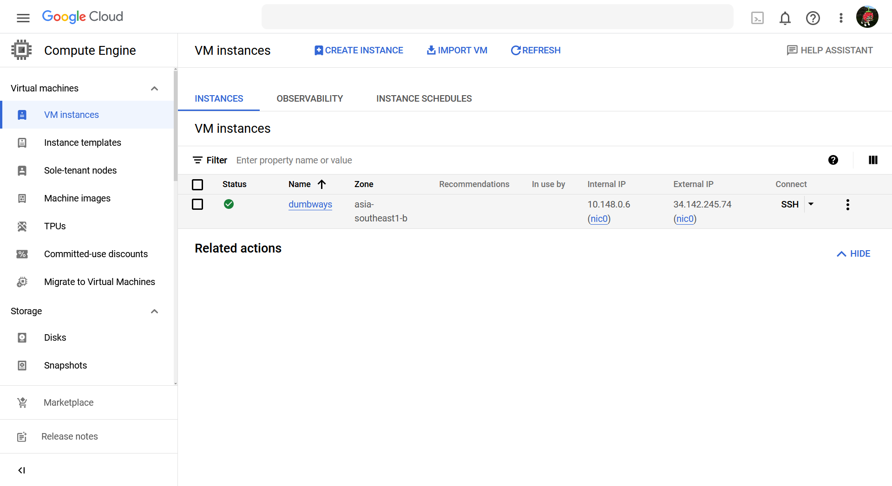

# instalasi terraform

## pada sistem operasi windows
buka powershell install scoop
```shell
Set-ExecutionPolicy RemoteSigned -Scope CurrentUser; irm get.scoop.sh | iex
```

install terraform menggunakan scoop
```shell
scoop install terraform
```


## pada sistem operasi ubuntu linux

install terraform menggunakan bash script
```shell
#!/bin/bash
sudo apt update
sudo apt install software-properties-common gpg gnupg2 curl -y
wget -O- https://apt.releases.hashicorp.com/gpg | gpg --dearmor | sudo tee /usr/share/keyrings/hashicorp-archive-keyring.gpg
gpg --no-default-keyring --keyring /usr/share/keyrings/hashicorp-archive-keyring.gpg --fingerprint
echo "deb [signed-by=/usr/share/keyrings/hashicorp-archive-keyring.gpg] https://apt.releases.hashicorp.com $(lsb_release -cs) main" | sudo tee /etc/apt/sources.list.d/hashicorp.list
sudo apt update
sudo apt install consul terraform -y
  
```


# membuat virtual machine di IDCloudhost menggunakan terraform

siapkan direktori untuk project terraform, buat file main.tf, variable.tf
dan terraform.tfvars

main.tf
```shell
terraform {
  required_providers {
    idcloudhost = {
      source  = "bapung/idcloudhost"
      version = "0.1.3"
    }
  }
}

provider "idcloudhost" {
  auth_token = var.auth_token
}

resource "idcloudhost_vm" "appserver" {
  billing_account_id = var.billing_account_id
  name               = "appserver"
  os_name            = "ubuntu"
  os_version         = "20.04"
  disks              = 20
  vcpu               = 2
  memory             = 2048
  username           = var.username
  initial_password   = var.initial_password
  public_key         = var.public_key
}

resource "idcloudhost_floating_ip" "appserver_network" {
  name               = "My Network"
  billing_account_id = var.billing_account_id
  assigned_to        = idcloudhost_vm.appserver.id
}

resource "idcloudhost_vm" "gateway" {
  billing_account_id = var.billing_account_id
  name               = "gateway"
  os_name            = "ubuntu"
  os_version         = "20.04"
  disks              = 20
  vcpu               = 1
  memory             = 1024
  username           = var.username
  initial_password   = var.initial_password
  public_key         = var.public_key

}

resource "idcloudhost_floating_ip" "gateway_network" {
  name               = "My Network"
  billing_account_id = var.billing_account_id
  assigned_to        = idcloudhost_vm.gateway.id
}

resource "idcloudhost_vm" "monitoring" {
  billing_account_id = var.billing_account_id
  name               = "gateway"
  os_name            = "ubuntu"
  os_version         = "20.04"
  disks              = 20
  vcpu               = 2
  memory             = 2048
  username           = var.username
  initial_password   = var.initial_password
  public_key         = var.public_key

}

resource "idcloudhost_floating_ip" "monitoring_network" {
  name               = "My Network"
  billing_account_id = var.billing_account_id
  assigned_to        = idcloudhost_vm.monitoring.id
}
```


variable.tf
```shell
variable "auth_token" {
  description = "masukan auth token : "
}

variable "billing_account_id" {
  description = "masukan billing account id : "
}

variable "username" {
  description = "masukan username : "
}

variable "initial_password" {
  description = "masukan password  : "
}

variable "public_key" {
  description = "masukan public key : "
}
```


terraform.tfvars
```shell
initial_password = "password"
auth_token = "auth_token"
billing_account_id = "1234567890"
username = "username"
public_key = "public_key"
```


setelah itu, inisialisasi direktori agar menjadi project terraform
```shell
terraform init
```


untuk melihat preview tentang apa saja yang akan dilakukan oleh
terraform, jalankan
```shell
terraform plan
```


jalankan script terraform
```shell
terraform apply -auto-approve
```

tunggu sampai proses pembuatan virtual machine berhasil


# membuat virtual machine di Google Cloud provider menggunakan terraform

## mendapatkan credentials
[pada halaman console google cloud](https://console.cloud.google.com)
cari service account


pilih titik tiga, create service account


masukan form


masuk ke service account yang sudah dibuat


pada menu keys, pilih ADD KEY > create new key > pilih create


simpan file yang telah di unduh

## membuat kode terraform
buat file main.tf

```shell
provider "google" {
  project     = "learn-gcp24"
  region      = "asia-southeast1"
  zone        = "asia-southeast1-b"
  credentials = "learn-gcp24-b1525d0dbb1d.json"
}

resource "google_compute_instance" "vm_instance" {
  name         = "dumbways"
  machine_type = "e2-small"
  boot_disk {
    initialize_params {
      image = "ubuntu-os-cloud/ubuntu-2004-lts"
    }
  }
  network_interface {
    network = "default"
    access_config {
    }
  }
}
```

jalankan terraform init
```shell
terraform init
```


terraform apply
```shell
terraform apply
```


input yes untuk konfirmasi


virtual machine berhasil dibuat
