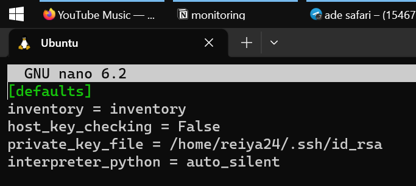
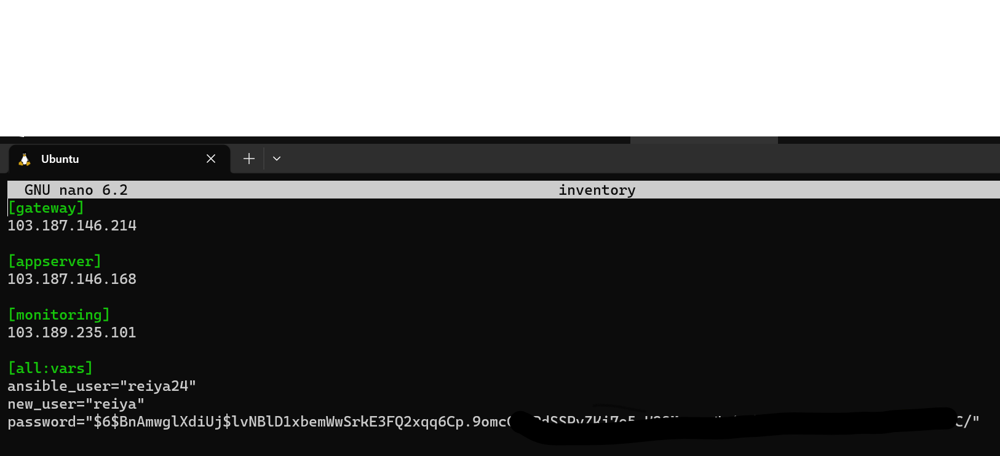
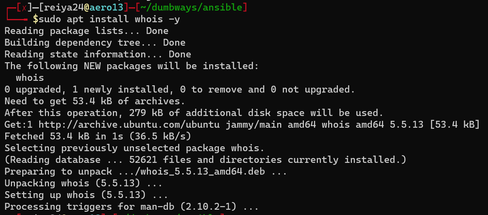
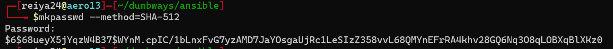
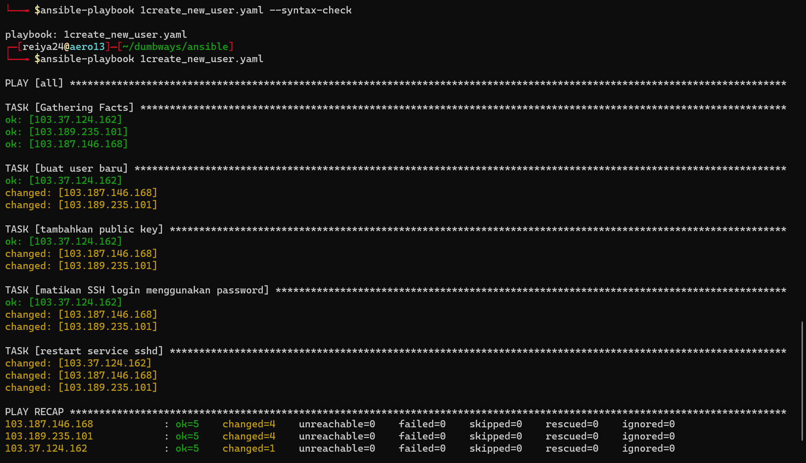
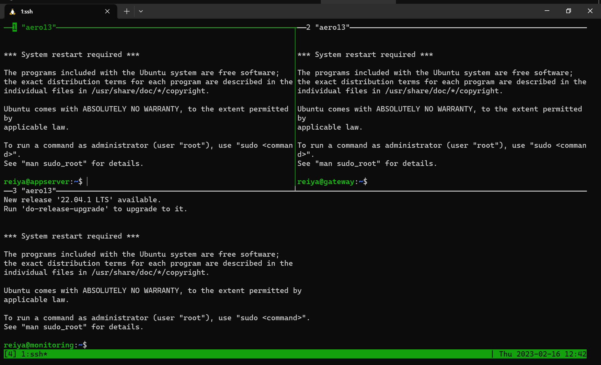
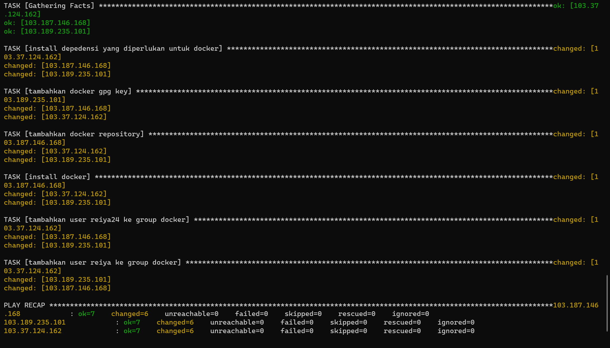
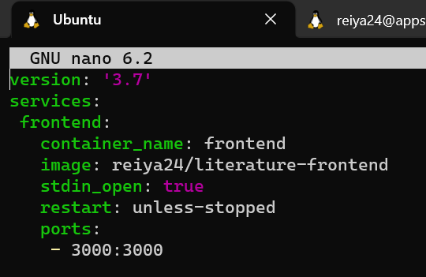
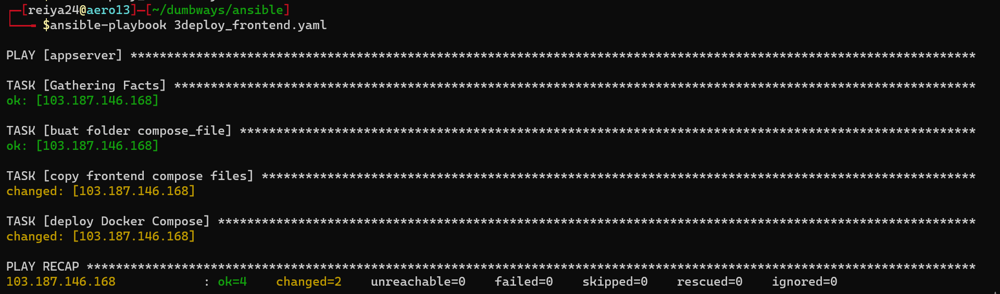

# instalasi ansible pada sistem operasi ubuntu linux

menggunakan bash script
```shell
#!/bin/bash
sudo apt update
sudo apt install software-properties-common -y
sudo add-apt-repository --yes --update ppa:ansible/ansible
sudo apt install ansible -y
```

# setup dasar ansible playbook

buat file ansible.cfg  yang berfungsi untuk menyimpan setingan dari
ansible
```shell
[defaults]
inventory = inventory
host_key_checking = False
private_key_file = /home/reiya24/.ssh/id_rsa
interpreter_python = auto_silent
```


buat file inventory untuk menyimpan variable dan IP server,
```shell
[gateway]
103.187.146.214

[appserver]
103.187.146.168

[monitoring]
103.189.235.101

[all:vars]
ansible_user="reiya24"
new_user="reiya"
password="kata_sandi"
```


untuk mengenkripsi password seperti digambar, install whois
```shell
sudo apt install whois -y
```


untuk mengenkripsi password, gunakan perintah
```shell
mkpasswd --method=SHA-512
```


# membuat ansible playbook
## membuat user baru dan mematikan login SSH menggunakan password

catatan: sebelum menjalankan ansible-playbook, cek syntax
terlebih dahulu menggunakan perintah
```yaml
ansible-playbook nama_file.yaml --synax-check
```

buat file berektensi .yaml
```yaml
---
- hosts: all
  become: true
  gather_facts: true
  tasks:
    - name: "buat user baru"
      ansible.builtin.user:
        name: "{{new_user}}"
        password: "{{password}}"
        groups: sudo
        shell: /bin/bash
        state: present
        create_home: true
        home: /home/{{new_user}}
    - name: "tambahkan public key"
      authorized_key:
        user: "{{new_user}}"
        state: present
        manage_dir: yes
        key: "{{ lookup('file', '~/.ssh/id_rsa.pub') }}"
    - name: "matikan SSH login menggunakan password"
      lineinfile:
        dest: /etc/ssh/sshd_config
        regexp: "^PasswordAuthentication"
        line: "PasswordAuthentication no"
        state: present
    - name: "restart service sshd"
      service:
        name: sshd
        state: restarted
```
jalankan playbook
```yaml
ansible-playbook 1create_new_user.yaml
```


user berhasil ditambahkan


## instalassi docker

```yaml
---
- hosts: all
  become: true
  gather_facts: true
  tasks:
    - name: install depedensi yang diperlukan untuk docker
      apt:
        pkg:
          - apt-transport-https
          - ca-certificates
          - curl
          - software-properties-common
          - python3-pip
          - virtualenv
          - python3-setuptools
        state: latest
        update_cache: true
    - name: tambahkan docker gpg key
      apt_key:
        url: https://download.docker.com/linux/ubuntu/gpg
        state: present
    - name: tambahkan docker repository
      apt_repository:
        repo: deb https://download.docker.com/linux/ubuntu focal stable
        state: present
    - name: install docker
      apt:
        name:
          - docker-ce
          - docker-ce-cli
          - containerd.io
          - docker-compose
          - docker-compose-plugin
        state: latest
        update_cache: yes
    - name: tambahkan user reiya24 ke group docker
      user:
        name: "{{ansible_user}}"
        groups: sudo, docker
        append: yes
    - name: tambahkan user reiya ke group docker
      user:
        name: "{{new_user}}"
        groups: sudo, docker
        append: yes
```

jalankan ansible playbook


## deploy aplikasi frontend on top docker

buat file docker compose
```yaml
version: '3.7'
services:
 frontend:
   container_name: frontend
   image: reiya24/literature-frontend
   stdin_open: true
   restart: unless-stopped
   ports:
    - 3000:3000
```


```yaml
---
- hosts: appserver
  become: true
  gather_facts: true
  tasks:
    - name: buat folder compose_file
      file:
        path: /home/{{ansible_user}}/compose_file
        state: directory
        owner: "{{ansible_user}}"

    - name: copy frontend compose files
      copy:
        src: compose_file/literature_frontend.yaml
        dest: /home/{{ansible_user}}/compose_file/literature_frontend.yaml
        owner: "{{ansible_user}}"

    - name: deploy Docker Compose
      community.docker.docker_compose:
        project_src: /home/{{ansible_user}}/compose_file
        files:
          - literature_frontend.yaml

```
jalankan ansible playbook
```yaml
ansible-playbook 3deploy_frontend.yaml
```


aplikasi berhasil terdepoy
