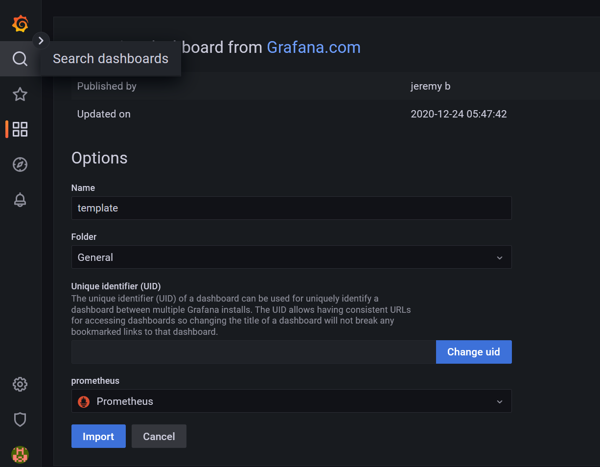

# instalasi node exporter on top docker

buat file docker compose
```yaml
version: '3.7'
services:
  node_exporter:
    container_name: node_exporter
    image: bitnami/node-exporter:latest 
    stdin_open: true
    restart: unless-stopped
    ports:
      - 9100:9100
```

buat ansible playbook
```yaml
---
- hosts: appserver,gateway
  become: true
  gather_facts: true
  tasks:
    - name: buat folder compose_file
      file:
        path: /home/{{ansible_user}}/compose_file
        state: directory
        owner: "{{ansible_user}}"

    - name: copy node exporter compose files
      copy:
        src: compose_file/node_exporter_compose.yaml
        dest: /home/{{ansible_user}}/compose_file/node_exporter_compose.yaml
        owner: "{{ansible_user}}"

    - name: deploy Docker Compose
      community.docker.docker_compose:
        project_src: /home/{{ansible_user}}/compose_file
        files:
          - node_exporter_compose.yaml
```

jalankan ansible playbook
```yaml
ansible-playbook 4install_node_exporter.yaml
```


# instalasi prometheus, copy prometheus.yml dan grafana

buat file prometheus.yml
```shell
global:
  scrape_interval: 5s
  evaluation_interval: 5s

scrape_configs:
  - job_name: prometheus
    static_configs:
      - targets: ["https://gateway-node.reiya.my.id","https://appserver-node.reiya.my.id","https://monitoring-node.reiya.my.id"]
```


buat docker compose
```yaml
version: '3.7'
services:
  prometheus:
    container_name: prometheus
    image: bitnami/prometheus:latest
    stdin_open: true
    restart: unless-stopped
    ports:
      - 9090:9090
    volumes:
      - ~/konfigurasi_prometheus/prometheus.yml:/etc/prometheus/prometheus.yml
  grafana:
    container_name: grafana
    image: grafana/grafana:latest
    stdin_open: true
    restart: unless-stopped
    ports:
      - 3123:3000
    volumes:
      - grafana-data:/etc/grafana/provisioning
      - grafana-data:/var/lib/grafana

volumes:
  grafana-data:
```

buat ansible playbook
```shell
---
- hosts: monitoring
  become: true
  gather_facts: true
  tasks:
    - name: buat folder konfigurasi_prometheus
      file:
        path: /home/{{ansible_user}}/konfigurasi_prometheus
        state: directory
        owner: "{{ansible_user}}"

    - name: copy file prometheus.yaml
      copy:
        src: prometheus/prometheus.yml
        dest: /home/{{ansible_user}}/konfigurasi_prometheus/prometheus.yml
        owner: "{{ansible_user}}"

    - name: copy prometheus_grafana_compose.yaml
      copy:
        src: compose_file/prometheus_grafana_compose.yaml
        dest: /home/{{ansible_user}}/compose_file/prometheus_grafana_compose.yaml
        owner: "{{ansible_user}}"

    - name: deploy Docker Compose
      community.docker.docker_compose:
        project_src: /home/{{ansible_user}}/compose_file
        files:
          - prometheus_grafana_compose.yaml
        remove_orphans: true
```

jalankan ansible playbook
```shell
ansible-playbook 5install_prometheus_grafana.yaml
```


# instalasi nginx dan reverse proxy,
buat file reverse proxy
```shell


server {
    server_name reiya.my.id;

    location / {
         proxy_pass http://10.116.106.88:3000;
    }
}


server {
    server_name appserver-node.reiya.my.id;

    location / {
         proxy_pass http://10.116.106.88:9100;
    }
}


server {
    server_name gateway-node.reiya.my.id;

    location / {
         proxy_pass http://10.116.106.56:9100;
    }
}


server {
    server_name prom.reiya.my.id;

    location / {
         proxy_pass http://10.116.106.36:9090;
    }
}

server {
    server_name dashboard.reiya.my.id;

    location / {
         proxy_pass http://10.116.106.36:3123;
    }
}
```

ansible playbook
```shell
---
- hosts: gateway
  become: true
  gather_facts: true
  tasks:
    - name: "install nginx menggunakan apt"
      apt:
        name: nginx
        state: latest
        update_cache: true
    - name: "jalankan service nginx"
      service:
        name: nginx
        state: started
    - name: "copy file konfigurasi nginx"
      copy:
        src: sites-enabled/
        dest: /etc/nginx/sites-enabled
    - name: "restart service nginx"
      service:
        name: nginx
        state: reloaded
    - name: Install certbot
      pip:
        name:
          - certbot
          - certbot-nginx
        executable: pip3
      tags:
        - nginx
        - certbot
    - name: jalankan certbot
      shell:
        "sudo certbot --nginx --non-interactive --agree-tos -d reiya.my.id -d appserver-node.reiya.my.id -d  gateway-node.reiya.my.id -d prom.reiya.my.id -d dashboard.reiya.my.id  --email reiya2307@gmail.com"


```

jalankan ansible playbook

```shell
ansible-playbook 6install_nginx_reverse_proxy.yaml
```


# setup grafana

masuk ke dashboard grafana, masukan user admin dan password admin


masukan password baru


## menambahkan data source

pilih icon setting > data source

add data source


pilih prometheus


masuk domain prometheus


masukan scrape interval dan query timeout


klik save and test


## membuat dashboard
pada icon kotak empat, klik new dashboard


add a new panel


### membuat instance untuk menampilkan persentase CPU
masukan query, masukan title
```shell
100 - (avg by(instance) (irate(node_cpu_seconds_total{mode="idle", instance="10.116.106.88:9100"}[5m])) * 100 ) 
```

lakukan hal yang sama untuk gateway

### membuat instance untuk menampilkan persentase memory
masukan query
```shell
100 * ((node_memory_MemTotal_bytes{instance="10.116.106.88:9100"} - node_memory_MemFree_bytes{instance="10.116.106.88:9100"} - node_memory_Buffers_bytes{instance="10.116.106.88:9100"} - node_memory_Cached_bytes{instance="10.116.106.88:9100"}) / node_memory_MemTotal_bytes{instance="10.116.106.88:9100"})
```

lakukan hal yang sama untuk gateway

save dashboard dengan mengklik icon save


masukan nama dashboard


# menggunakan template

template dari
https://grafana.com/grafana/dashboards/1860-node-exporter-full/

pada menu dashboard, plilih import


masukan kode


masukan form


masukan nama dan data source


save dashboard


# alerting

## setup integrasi slack dan grafana
masuk ke https://api.slack.com , pilih create ann app


pilih from strach


masukan app name dan workspace slack


pilih incoming webhook


activate incoming webhook


add new webhook to workspace


pilih channel


copy webhook url


pada dashboard grafana, klik alerting, notification policies


pada root policies, pilih edit > create a contact point
masukan nama, contact point types, webhook url, klik test


send test notification


pengiriman notifikasi berhasil


save contact point
