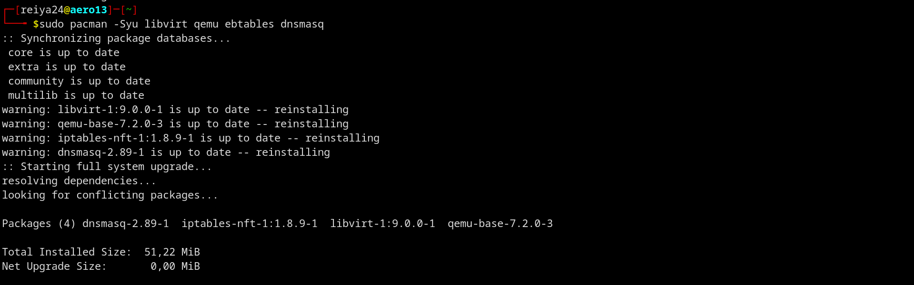
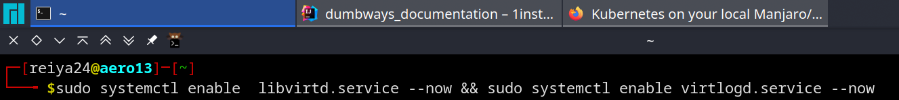
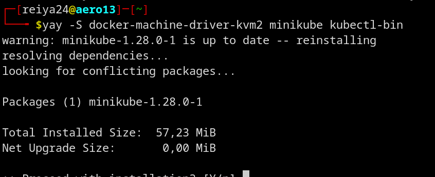
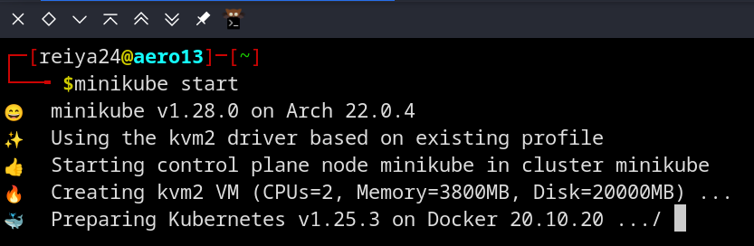

# pada sistem operasi berbasis arch linux

install depedensi yang diperlukan
```shell
sudo pacman -Syu libvirt qemu ebtables dnsmasq
```


jalankan service yang diperlukan
```shell
sudo systemctl enable  libvirtd.service --now && sudo systemctl enable virtlogd.service --now
```


instal kvm2-driver, minikube dan kubectl
```shell
yay -S docker-machine-driver-kvm2 minikube kubectl-bin
```


restart komputer

jalankan minikube
```shell
minikube start
```


