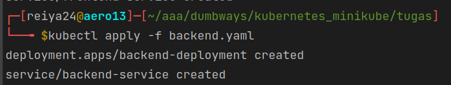

# frontend
buat file konfigurasi
```shell
apiVersion: apps/v1
kind: Deployment
metadata:
  name: frontend-deployment
spec:
  selector:
    matchLabels:
      app: frontend-label
  replicas: 1
  template:
    metadata:
      labels:
        app: frontend-label
    spec:
      containers:
        - name: frontend-container
          image: reiya24/literature-frontend:latest
          stdin: true
          stdinOnce: false
          tty: true
          ports:
            - containerPort: 3000

---

apiVersion: v1
kind: Service
metadata:
  name: frontend-service
spec:
  type: NodePort
  selector:
    app: frontend-label
  ports:
    - port: 3000
      targetPort: 3000
      nodePort: 30000
```


jalankan file konfigurasi
```shell
kubectl apply -f nama_file.yaml
```


expose service nodeport ke host
```shell
minikube service nama_service
```


# backend

```shell
apiVersion: apps/v1
kind: Deployment
metadata:
  name: backend-deployment
spec:
  selector:
    matchLabels:
      app: backend-label
  replicas: 1
  template:
    metadata:
      labels:
        app: backend-label
    spec:
      containers:
        - name: backend-container
          image: naninanides/literature-backend:latest
          stdin: true
          stdinOnce: false
          tty: true
          ports:
            - containerPort: 5000

---

apiVersion: v1
kind: Service
metadata:
  name: backend-service
spec:
  type: NodePort
  selector:
    app: backend-label
  ports:
    - port: 5000
      targetPort: 5000
      nodePort: 32500
```


jalankan file konfigurasi
```shell
kubectl apply -f nama_file.yaml
```


expose service
```shell
minikube service nama_service
```


