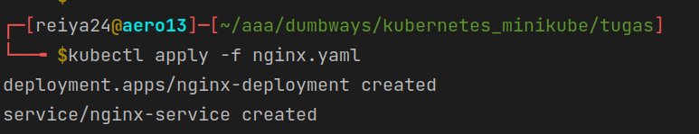

buat file konfigurasi
```shell
apiVersion: apps/v1
kind: Deployment
metadata:
  name: nginx-deployment
spec:
  selector:
    matchLabels:
      app: nginx-label
  replicas: 1
  template:
    metadata:
      labels:
        app: nginx-label
    spec:
      containers:
        - name: nginx-container
          image: nginx:latest
          stdin: true
          stdinOnce: false
          tty: true
          ports:
            - containerPort: 80

---

apiVersion: v1
kind: Service
metadata:
  name: nginx-service
spec:
  type: NodePort
  selector:
    app: nginx-label
  ports:
    - port: 80
      targetPort: 80
      nodePort: 30800
```


jalankan file konfigurasi
```shell
kubectl apply -f nama_file.yaml
```


expose service
```shell
minikube service nama_service.yaml
```


