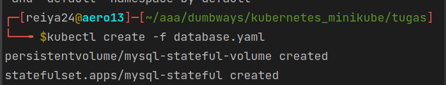
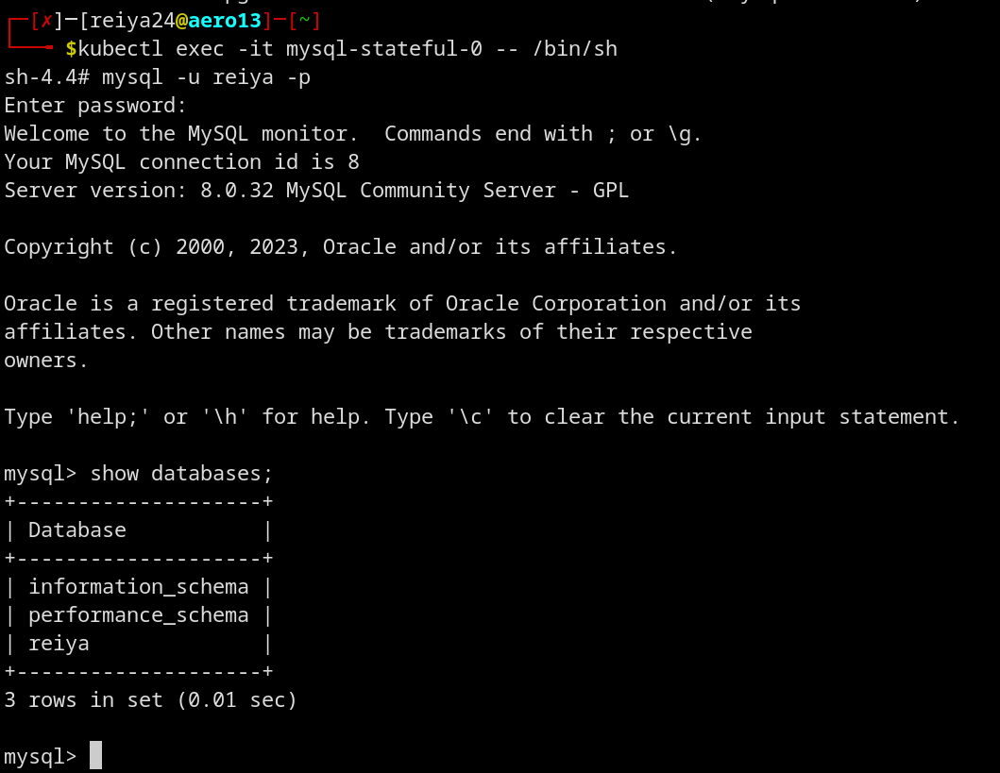

buat file konfigurasi
```yaml
apiVersion: v1
kind: PersistentVolume
metadata:
  name: mysql-stateful-volume
spec:
  accessModes:
    - ReadWriteOnce
  capacity:
    storage: 10Gi
  hostPath:
    path: /var/lib/mysql

---

apiVersion: apps/v1
kind: StatefulSet
metadata:
  name: mysql-stateful
  labels:
    name: mysql-stateful
spec:
  serviceName: mysql-stateful-service
  replicas: 1
  selector:
    matchLabels:
      name: mysql-stateful
  volumeClaimTemplates:
    - metadata:
        name: mysql-stateful-volume-claim
      spec:
        accessModes:
            - ReadWriteOnce
        volumeMode: Filesystem
        resources:
          requests:
            storage: 5Gi
  template:
    metadata:
      name: mysql-stateful
      labels:
        name: mysql-stateful
    spec:
      containers:
        - name: mysql-stateful
          image: mysql:latest
          env:
            - name: MYSQL_ROOT_PASSWORD
              value: "reiya"
            - name: MYSQL_USER
              value: "reiya"
            - name: MYSQL_PASSWORD
              value: "reiya"
            - name: MYSQL_DATABASE
              value: "reiya"
          volumeMounts:
            - mountPath: /var/lib/mysql
              name: mysql-stateful-volume-claim

```
jalankan file konfigurasi
```yaml
kubectl apply -f nama_file.yaml
```


masuk ke dalam container
